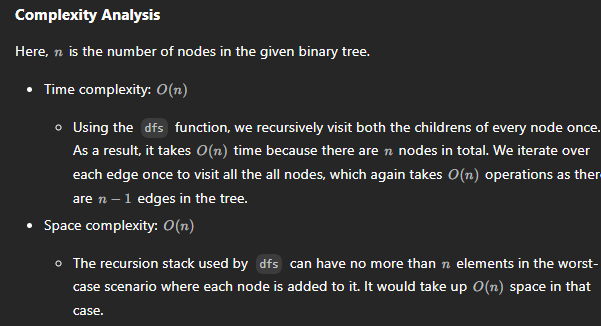

# 1372.  Longest ZigZag Path in a Binary Tree

## Approach - recursion


```java
class Solution {
    int pathLength = 0;

    public int longestZigZag(TreeNode root) {
        dfs(root, false, 0);
        dfs(root, true, 0);
        return pathLength;
    }


    public void dfs(TreeNode node, boolean goLeft, int steps) {
        if (root = null) return;

        pathLength = Math.max(pathLength, steps);

        if (goLeft) {
            dfs(node.left, false, steps +1);
            dfs(node.right, true, 1);
        } else {
            dfs(node.right, true, steps +1);
            dfs(node.left, false, 1);
        }
        
    }
}
```

