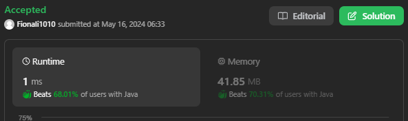

# 199. Binary Tree Right Side View

## Approach 1 by Lei - one Queue and BFS



```java
class Solution {
    public List<Integer> rightSideView(TreeNode root) {
        List<Integer> list = new ArrayList<>();
        if (root == null) return list;
        Queue<TreeNode> que = new LinkedList<>();

        que.add(root);

        while (!que.isEmpty()) {
            int size = que.size();

            for (int i = 0; i < size; i++) {
                TreeNode node = que.poll();
                if ( i == size -1) {
                    list.add(node.val);
                }

                 if (node.left != null) {
                    que.add(node.left);
                }

                if (node.right != null) {
                    que.add(node.right);
                }
            }
        }
        return list;
    }
}
```
- Time complexity: O(N) since one has to visit each node.
- Space complexity: O(D) to keep the queues, where DDD is a tree diameter. Let's use the last level to estimate the queue size. This level could contain up to N/2 tree nodes in the case of complete binary tree.


## Appraoch 2 - two queue and BFS

```java
class Solution {
    public List<Integer> rightSideView(TreeNode root) {
        List<Integer> list = new ArrayList<>();
        List<TreeNode> curLevel = new ArrayList<>();

        if (root != null) curLevel.add(root);

        while (!curLevel.isEmpty()) {
            list.add(curLevel.get(curLevel.size()-1).val);
            List<TreeNode> nextLevel = new ArrayList<>();

            for (TreeNode node: curLevel) {
                if (node.left != null) {
                    nextLevel.add(node.left);
                }

                if (node.right != null) {
                    nextLevel.add(node.right);
                }
            }

            curLevel = nextLevel;
        }

        return list;
    }
}
```

- same as approach 1;

## Approach 3 - DFS


```java
class Solution {

    List<Integer> rightSide = new ArrayList<>();
    
    public List<Integer> rightSideView(TreeNode root) {
        if (root == null) return rightSide;
        helper(root, 0); // 让层数对应arraylist size
        return rightSide;
    }

    public void helper(TreeNode node, int level) {
        if (rightSide.size() == level) { // 非常重要的判断；
            rightSide.add(node.val);
        }

        if (node.right != null) helper(node.right, level+1);
        if (node.left != null) helper(node.left, level+1);
    }
}
```
- Time complexity: O(N)) since one has to visit each node.
- Space complexity: O(H) to keep the recursion stack, where H is a tree height. The worst-case situation is a skewed tree when H=N.