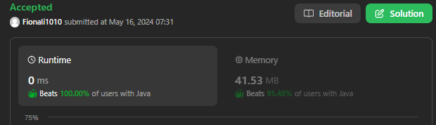

# 199. Binary Tree Right Side View

## Approach 1 - Queue and BFS

```java
class Solution {
    public List<Integer> rightSideView(TreeNode root) {
        List<Integer> res = new ArrayList<>();
        if (root == null) return res;

        Deque<TreeNode> que = new ArrayDeque<>();
        que.offer(root);

        while (!que.isEmpty()) {
            int n = que.size();

            for (int i = 0; i < n; i++) {
                TreeNode cur = que.poll();
                if (i == n-1) res.add(cur.val);
                
                if (cur.left != null) que.offer(cur.left);
                if (cur.right != null) que.offer(cur.right);
            }
        }
        return res;
    }
}
```
- Time complexity: O(N) since one has to visit each node.
- Space complexity: O(D) to keep the queues, where DDD is a tree diameter. Let's use the last level to estimate the queue size. This level could contain up to N/2 tree nodes in the case of complete binary tree.


## Approach 2 - DFS



```java
class Solution {

    List<Integer> rightSide = new ArrayList<>();
    
    public List<Integer> rightSideView(TreeNode root) {
        if (root == null) return rightSide;
        helper(root, 0); // 让层数对应arraylist size
        return rightSide;
    }

    public void helper(TreeNode node, int level) {
        if (rightSide.size() == level) { // 非常重要的判断；
            rightSide.add(node.val);
        }

        if (node.right != null) helper(node.right, level+1);
        if (node.left != null) helper(node.left, level+1);
    }
}
```
- Time complexity: O(N)) since one has to visit each node.
- Space complexity: O(H) to keep the recursion stack, where H is a tree height. The worst-case situation is a skewed tree when H=N.