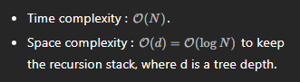

# 222. Count Complete Tree Nodes

- preorder dfs

```java
class Solution {

    private int count;

    public int countNodes(TreeNode root) {
        if (root == null) return 0;

        count += 1;

        countNodes(root.left);
        countNodes(root.right);

        return count;
    }
}

// another similar way
class Solution {
  public int countNodes(TreeNode root) {
    return root != null ? 1 + countNodes(root.right) + countNodes(root.left) : 0;
  }
}
```
