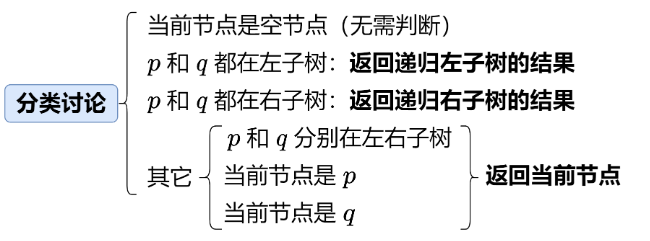

# 235. Lowest Common Ancestor of a Binary Search Tree

## Approach 1 - DFS (不推荐)
- 这是一种比较慢的方法，因为没有考虑BST的特性，只是把它当作普通的Binary Tree
- 左右中的判断方法，如果三者中能找到两者为true, 则找到了，不然的话就向上返回三者中是否有true的boolean值

```java
class Solution {
    TreeNode res;

    public TreeNode lowestCommonAncestor(TreeNode node, TreeNode p, TreeNode q) {
        dfs(node, p, q);
        return res;
    }

    private boolean dfs(TreeNode node, TreeNode p, TreeNode q) {
        if (node == null) return false;

        if (res != null) return false; // 表明已经找到了 没必要再继续找了， return 什么无所谓 只需要不在继续运行

        boolean left = dfs(node.left, p, q);
        boolean right = dfs(node.right, p, q);  
        // Since all nodes in the tree are guaranteed to be unique, we don’t need to distinguish whether we found p or q specifically — just that we found two distinct matches among the current node and its left/right subtrees.
        boolean mid = node.val == p.val || node.val == q.val;
        if (mid && left || mid && right || right && left) {
            res = node;
        }
        return mid || left || right;
    }
}
```
- time: O(N)
- Space: O(N)

## Approach 2 - BST && DFS (推荐)



- 这种方法比较快，考虑了BST的特性避免了一些没必要的recursion
- recap - for any node root in a BST:
    - All nodes in the left subtree have values less than root.val
    - All nodes in the right subtree have values greater than root.val

```java
class Solution {
    public TreeNode lowestCommonAncestor(TreeNode root, TreeNode p, TreeNode q) {
        int x = root.val;
        if (p.val < x && q.val < x) { // p 和 q 都在左子树
            return lowestCommonAncestor(root.left, p, q);
        }
        if (p.val > x && q.val > x) { // p 和 q 都在右子树
            return lowestCommonAncestor(root.right, p, q);
        }
        return root; // 其它， pq在root两边或者其中一个node是root
    }
}
```
- time: O(LogN), 其中 n 为二叉搜索树的节点个数。注意题目没有保证这棵树是平衡的。最坏情况下，树退化成一条链，且 p 和 q 在最底下，那么递归就需要 O(n) 的时间。
- Space: O(1) 空间复杂度：O(n)。最坏情况下，二叉搜索树退化成一条链（注意题目没有保证它是平衡树），因此递归需要 O(n) 的栈空间。
