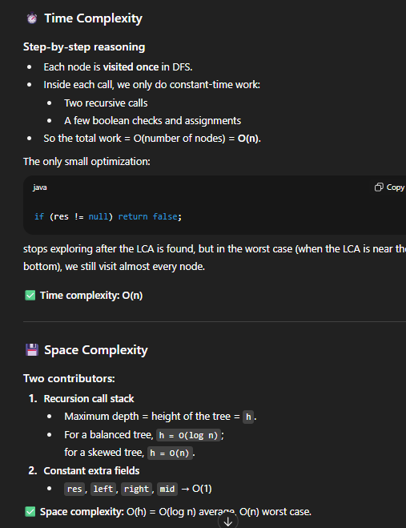
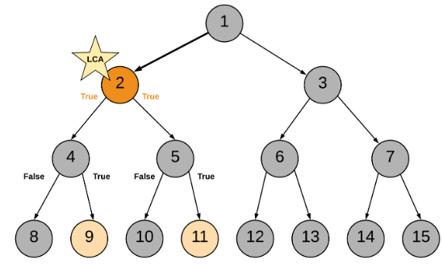
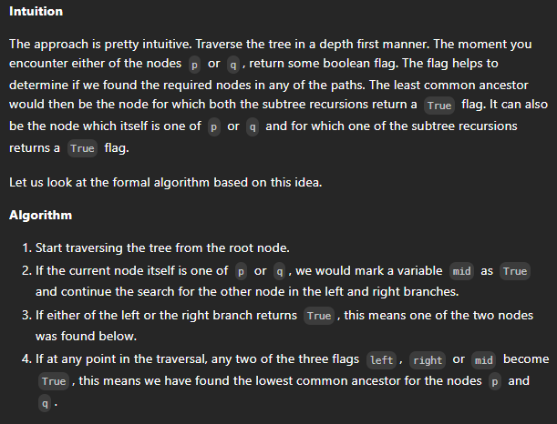
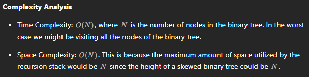

# 236. Lowest Common Ancestor of a Binary Tree

## Approach 1 - postorder DFS
- 什么是LCA? 一个node必须收获两个true才能成为LCA
- 用postorder DFS 是因为要先reach 最底层然后再做判断



```java
class Solution {
    TreeNode res;

    public TreeNode lowestCommonAncestor(TreeNode root, TreeNode p, TreeNode q) {
        // intput: tree, node1 and node2;
        // output: integer, No.of node
        findLCA(root, p, q);
        return res;
    }

    public boolean findLCA(TreeNode root, TreeNode p, TreeNode q) {
        if (root == null) return false;

        // 已经找到答案了 所以res才不是null 直接返回false 结束dfs
        if (res != null) return false;

        //find the target node
        boolean left = findLCA(root.left, p, q);
        boolean right = findLCA(root.right, p, q);
        boolean curr = root == p || root == q; 

        // 关键是每个node的val是unique的
        if ((left && right ) || (left && curr) || (right && curr)) 
            res = root;

        return left || right || curr;        
    }
}
```
## Approach 2 - postorder DFS

- a very similar approach






```java
class Solution {

    TreeNode ans;

    public boolean recurseTree(TreeNode currentNode, TreeNode p, TreeNode q) {

        // If reached the end of a branch, return false.
        if (currentNode == null) {
            return false;
        }

        // Left Recursion. If left recursion returns true, set left = 1 else 0
        int left = recurseTree(currentNode.left, p, q) ? 1 : 0;

        // Right Recursion
        int right = recurseTree(currentNode.right, p, q) ? 1 : 0;

        // If the current node is one of p or q
        int mid = (currentNode == p || currentNode == q) ? 1 : 0;


        // If any two of the flags left, right or mid become True
        if (mid + left + right == 2) {
            ans = currentNode;
        }

        // Return true if any one of the three bool values is True.
        return (mid + left + right > 0);
    }

    public TreeNode lowestCommonAncestor(TreeNode root, TreeNode p, TreeNode q) {
        // Traverse the tree
        recurseTree(root, p, q);
        return ans;
    }
}

```


##  Approach 3 - interation


```java
class Solution {

    public TreeNode lowestCommonAncestor(TreeNode root, TreeNode p, TreeNode q) {

        // Stack for tree traversal
        Deque<TreeNode> stack = new ArrayDeque<>();

        // HashMap for parent pointers
        Map<TreeNode, TreeNode> parent = new HashMap<>();

        parent.put(root, null);
        stack.push(root);

        // Iterate until we find both the nodes p and q
        while (!parent.containsKey(p) || !parent.containsKey(q)) {

            TreeNode node = stack.pop();

            // While traversing the tree, keep saving the parent pointers.
            if (node.left != null) {
                parent.put(node.left, node);
                stack.push(node.left);
            }
            if (node.right != null) {
                parent.put(node.right, node);
                stack.push(node.right);
            }
        }

        // Ancestors set() for node p.
        Set<TreeNode> ancestors = new HashSet<>();

        // Process all ancestors for node p using parent pointers.
        while (p != null) {
            ancestors.add(p);
            p = parent.get(p);
        }

        // The first ancestor of q which appears in
        // p's ancestor set() is their lowest common ancestor.
        while (!ancestors.contains(q))
            q = parent.get(q);
        return q;
    }

}
```