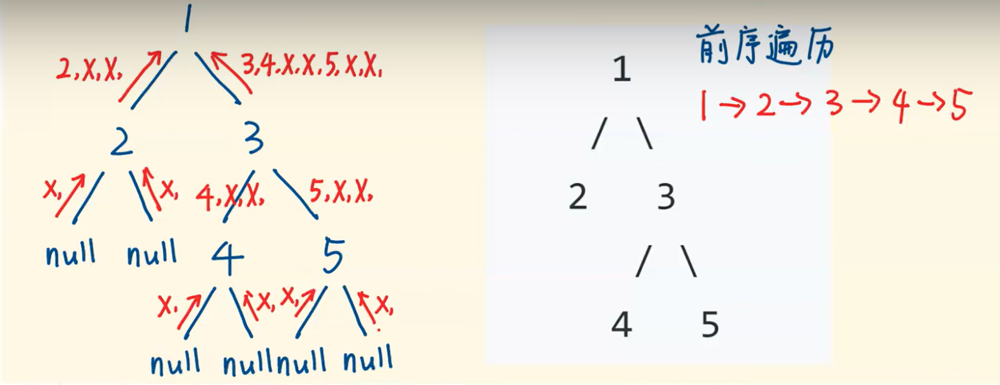
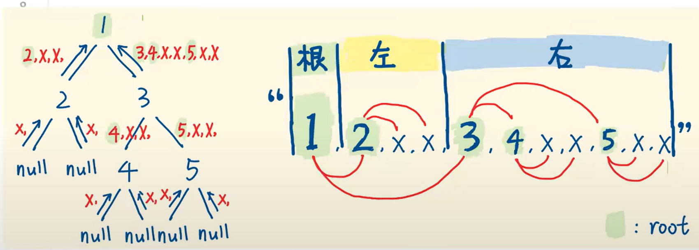

# Serialize and Deserialize Binary Tree

## Approach 1 - preorder dfs
- Serialize

- Deserialize

- 只在leaf上将leaf的左右节点填充为“#”，便于区分是否为叶子节点同时也可以区分左右子树

```java
/**
 * Definition for a binary tree node.
 * public class TreeNode {
 *     int val;
 *     TreeNode left;
 *     TreeNode right;
 *     TreeNode(int x) { val = x; }
 * }
 */
public class Codec {

    // Encodes a tree to a single string.
    public String serialize(TreeNode root) {
        if (root == null) return "#";
        StringBuilder sb = new StringBuilder();
        sb.append(root.val);
        sb.append(",").append(serialize(root.left)); 
        sb.append(",").append(serialize(root.right));
        return sb.toString();
    }

    // Decodes your encoded data to tree.
    public TreeNode deserialize(String data) {
        String[] strs = data.split(",");
        Deque<String> que = new ArrayDeque<>();
        for (String str: strs) {
            que.offer(str);
        }
        return helper(que);
    }

    private TreeNode helper(Deque<String> que) {
        String s = que.poll();
        if (s.equals("#")) return null;
        TreeNode root = new TreeNode(Integer.valueOf(s));
        root.left = helper(que);
        root.right = helper(que);
        return root;
    } 
}

// Your Codec object will be instantiated and called as such:
// Codec ser = new Codec();
// Codec deser = new Codec();
// TreeNode ans = deser.deserialize(ser.serialize(root));

```
- time：O(N)
- space: O(N)