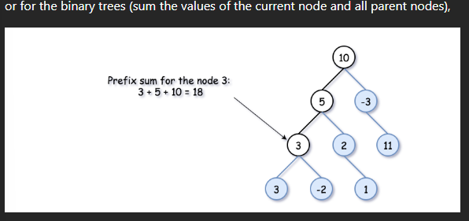
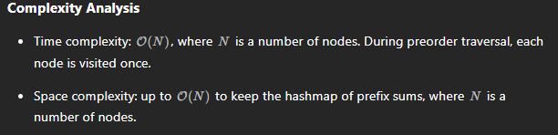

# 437. Path Sum III

## Approach 1 - prefix sum


[tutorial](https://leetcode.com/problems/path-sum-iii/?envType=study-plan-v2&envId=leetcode-75)



- 做这道题之前

```java
class Solution {
    int count = 0;
    int k;
    HashMap<Long, Integer> h = new HashMap(); // long to prevent curSum overflow;
    
    public int pathSum(TreeNode root, int targetSum) {
        k = targetSum;
        preorder(root, 0L); // explicitly assign sum as long type
        return count;
    }

    public void preorder(TreeNode node, long currSum) {
        if (node == null)
            return;
        
        // The current prefix sum
        currSum += node.val;

        // senario 1: Here is the sum we're looking for
        if (currSum == k)
            count++;
        
        // senario 2: The number of times the curr_sum − k has occurred already, 
        // determines the number of times a path with sum k 
        // has occurred up to the current node
        count += h.getOrDefault(currSum - k, 0);
        
        //Add the current sum into the hashmap
        // to use it during the child node's processing
        h.put(currSum, h.getOrDefault(currSum, 0) + 1);

        // Process the left subtree
        preorder(node.left, currSum);

        // Process the right subtree
        preorder(node.right, currSum);

        // Remove the current sum from the hashmap
        // in order not to use it during 
        // the parallel subtree processing
        h.put(currSum, h.get(currSum) - 1);
    }    
            
    
}
```
