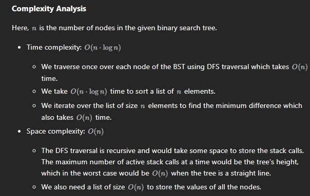

# 530. Minimum Absolute Difference in BST

## Approach 1 - dfs + list


- 中序遍历是单调升序；
- 后一个减去前一个，再比较最小差值；

```java
class Solution {
    private List<Integer> list;

    public void dfs(TreeNode root) {
        
        if (root == null) return;
        
        dfs(root.left);
        list.add(root.val); //in order 操作在中间
        dfs(root.right);
    }

    public int getMinimumDifference(TreeNode root) {
        int min = Integer.MAX_VALUE;
        list  = new ArrayList<>(); 
        
        dfs(root);

        for (int i = list.size()-1; i > 0; i--) {
            min = Math.min(min, list.get(i)-list.get(i-1));
        }

        return min;
    }
}
```
- corrct time to be O(n)


## Approach 2 - dfs without list


```java
class Solution {
    TreeNode pre;
    int min;
    
    public int getMinimumDifference(TreeNode root) {
        min = Integer.MAX_VALUE;
        dfs(root);
        return min;
    }

    public void dfs(TreeNode root) {
        if (root == null) return;

        dfs(root.left);

        if (pre != null) {
            min = Math.min(min, Math.abs(root.val-pre.val));
        }
        pre = root;
    
        dfs(root.right);
    }
}

```