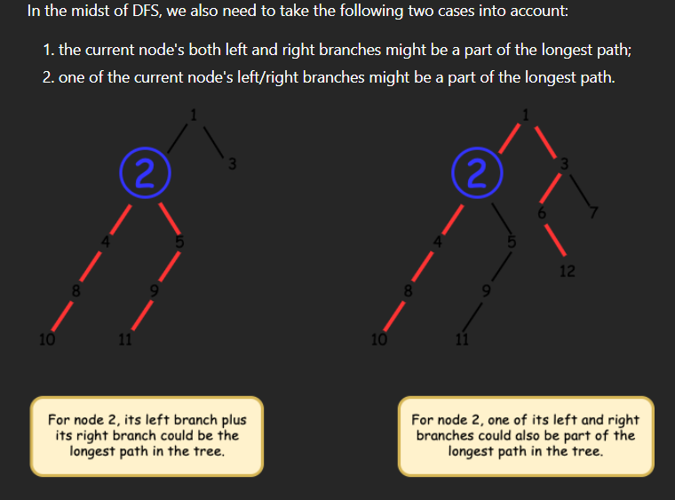
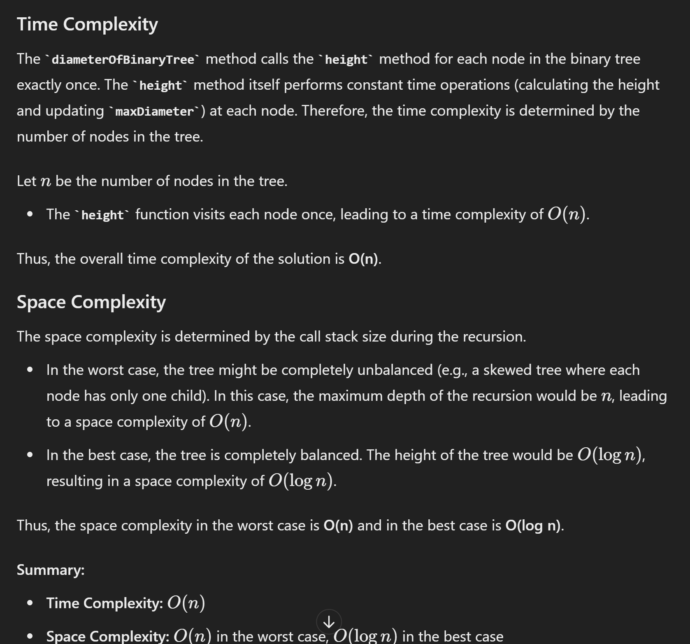

# 543. Diameter of Binary Tree



- 最长path只可能出现在leaf & leaf 之间， 要考虑两种情况图中出现的两种情况

```java
/**
 * Definition for a binary tree node.
 * public class TreeNode {
 *     int val;
 *     TreeNode left;
 *     TreeNode right;
 *     TreeNode() {}
 *     TreeNode(int val) { this.val = val; }
 *     TreeNode(int val, TreeNode left, TreeNode right) {
 *         this.val = val;
 *         this.left = left;
 *         this.right = right;
 *     }
 * }
 */
class Solution {
    private int maxDiameter = 0;

    public int diameterOfBinaryTree(TreeNode root) {
        height(root);
        return maxDiameter;
    }

    public int height(TreeNode node) {
        if (node == null) {
            return 0;
        }

        int leftHeight = height(node.left);
        int rightHeight = height(node.right);

        // Calculate diameter at this node
        // We do not need leftHeight + rightHeight + 1, becuase the definition of diameter between two nodes are edges not number of nodes
        int diameter = leftHeight + rightHeight;
        
        // Update max diameter if this is the largest we've seen
        maxDiameter = Math.max(maxDiameter, diameter);

        // Return the height of the current node
        return 1 + Math.max(leftHeight, rightHeight);
    }
}

```

