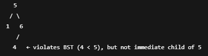

# 98. Validate Binary Search Tree

- All values in the left subtree must be less than root.val
- and all values in the right subtree must be greater than root.val.
- root could be any subnode

## Approach 1 - dfs recursion

- 这道题的难点在于你不仅要比较当下的三个node (node, node.right, node.left), 而是左边的所有node 都要比root 小， 右边的所有nodes都要比root 大


- 方法是利用大小两个边界，每一个node.val都必须符合（min, max)， 否则return false 
    - 不是[min, max], 这是题目规定的不能相等
- 每一个recursion 都要更新边界，左子树update max to root.val, 右子树update min to root.val
- 难点是the initial value of min and max cannot be Integer.MIN_VALUE or Integer.MAX_VALUE, or when node.val == Integer.MIN_VALUE or Integer.MAX_VALUE, it will return false while it should not, so we use Long.MIN_VALUE and Long.MAX_VALUE

```java 
class Solution {
    public boolean isValidBST(TreeNode root) {
        if (root == null) {
            return true;
        }

        return dfs(root, Long.MIN_VALUE, Long.MAX_VALUE);
    }

    private boolean dfs(TreeNode root, long minVal, long maxVal) {
        if (root == null) {
            return true;
        }

        if (root.val <= minVal || root.val >= maxVal) {
            return false;
        }

        return dfs(root.left, minVal, root.val) && dfs(root.right, root.val, maxVal);
    }
}
```


## Approach 1 - iterative version

```java
class Solution {
    private Deque<TreeNode> que = new LinkedList();
    private Deque<Integer> upperLimits = new LinkedList();
    private Deque<Integer> lowerLimits = new LinkedList();

    public void update(TreeNode root, Integer low, Integer high) {
        que.add(root);
        lowerLimits.add(low);
        upperLimits.add(high);
    }

    public boolean isValidBST(TreeNode root) {
        Integer low = null, high = null, val;
        update(root, low, high);

        while (!que.isEmpty()) {
            root = que.poll();
            low = lowerLimits.poll();
            high = upperLimits.poll();

            if (root == null) continue;
            val = root.val;
            if (low != null && val <= low) {
                return false;
            }
            if (high != null && val >= high) {
                return false;
            }
            update(root.right, val, high);
            update(root.left, low, val);
        }
        return true;
    }
}
```

## Approach 2 - Recursive Inorder Traversal

- BST中序遍历单调递增

```java
class Solution {
    // We use Integer instead of int as it supports a null value.
    private Integer prev;

    public boolean isValidBST(TreeNode root) {
        prev = null;
        return inorder(root);
    }

    private boolean inorder(TreeNode root) {
        if (root == null) {
            return true;
        }
        if (!inorder(root.left)) {
            return false;
        }
        if (prev != null && root.val <= prev) {
            return false;
        }
        prev = root.val;
        return inorder(root.right);
    }
}
```

## Approach 2 - Interative version

- BST中序遍历单调递增
- 遍历从root走到最左边，再往右边，再走到该右边的最左边

```java
class Solution {
    public boolean isValidBST(TreeNode root) {
        Deque<TreeNode> stack = new ArrayDeque<>();
        Integer prev = null;

        while (!stack.isEmpty() || root != null) {
            // 走到树的最左边一个点, 如果是null, 会pop stack里面的下一个点
            while (root != null) {
                stack.push(root);
                root = root.left;
            }
            // pop最左边一个点
            root = stack.pop();

            // If next element in inorder traversal
            // is smaller than the previous one
            // that's not BST.
            if (prev != null && root.val <= prev) {
                return false;
            }
            //更新prev
            prev = root.val;
            //走到该node的右边if any
            root = root.right;
        }
        return true;
    }
}
```

