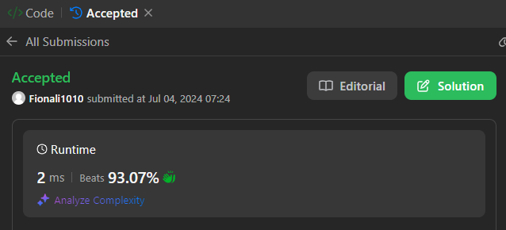
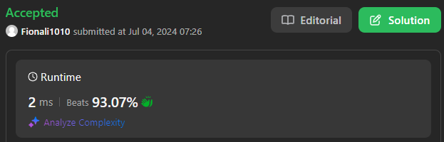
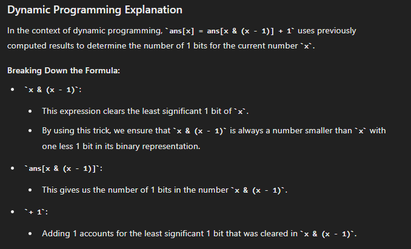
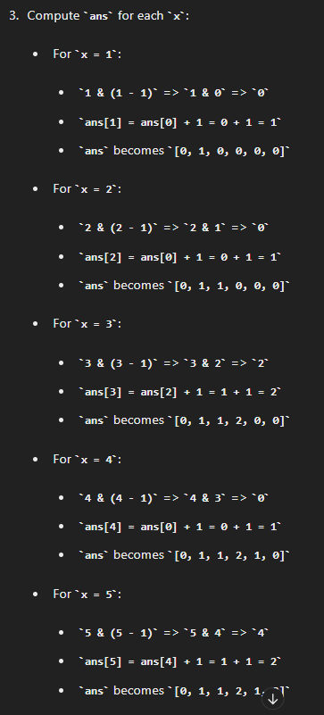

# 338. Counting Bits

## approach 1


```java
class Solution {
    public int[] countBits(int n) {
        int[] res = new int[n+1];

        for (int i = 0; i < res.length; i++) {
            res[i] = bits(i);
        }

        return res;
    }

    public int bits(int n) {
        int count = 0;

        while (n != 0) {
            if (n % 2 == 1) {
                count++;
            }

            n = n/2;
        }

        return count;
    }
}

```
## approach 2 - DP 1



```java
public class Solution {
    public int[] countBits(int n) {
        int[] ans = new int[n + 1];
        for (int x = 1; x <= n; ++x) {
            // x / 2 is x >> 1 and x % 2 is x & 1
            ans[x] = ans[x /2] + (x % 2); 
        }
        return ans;
    }
}

// or anohter way
public class Solution {
    public int[] countBits(int n) {
        int[] ans = new int[n + 1];
        for (int x = 1; x <= n; ++x) {
            // x / 2 is x >> 1 and x % 2 is x & 1
            ans[x] = ans[x >> 1] + (x & 1); 
        }
        return ans;
    }
}
```

## approach 3 - DP 2


```java
public class Solution {
    public int[] countBits(int num) {
        int[] ans = new int[num + 1];
        for (int x = 1; x <= num; ++x) {
            ans[x] = ans[x & (x - 1)] + 1;
        }
        return ans;
    }
}
```



