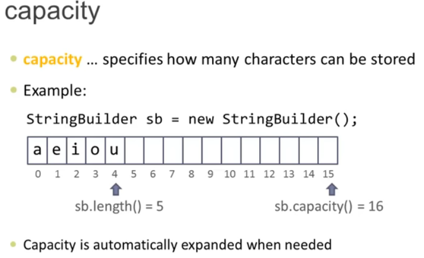
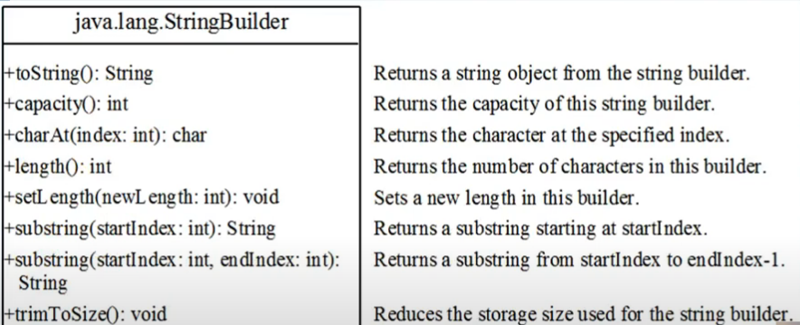
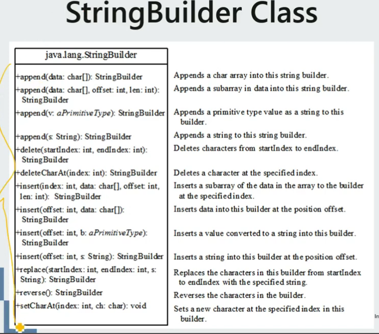

# Commonly Used Methods

## 1. String
### properties and methods

```java
String s = "Hello World";
String letters = "abced";

// properties: 
s.length();
s.charAt(2); // character at index 2 in string s

// methods:
char[] = s.toCharArray(); // turn string s to an array ['H','e','l','l','o',' ','W','o','r','l','d']
s.isEmpty(); // output true or false
s.toLowerCase();
s.toUpperCase();
s.replaceAll("[^a-z0-9]", ""); // turn anything that's not a num or letter into "", ^ means not
s.replaceALL("is", "was");
letters.substring(1,4) // "bce" [1,4) 
letters.substring(1);
letters.indexOf("bc") // 1

// turn num/float to string - String.valueOf(num);
String intStr = String.valueOf(3); // turn num 3 to string "3"
String floatStr = String.valueOf(3.14); // turn float 3.14 to string "3.14"
// turn string to num - Integer.parseInt("num") or Float.parseFloat("float")
int intNum = Integer.parseInt("3"); // turn string "3" to num 3
float floatNum = Float.parseFloat("3.14"); // turn string "3.14" to num 3.14

// turn num to char using (char) and turn char to num using (int)
System.out.println((char)(2+'a')); // 'c'
System.out.println((char)(97)); // 'a'
System.out.println((int)'a'); // 97

// compare strings, using equals is always better
String str1 = "abc";
String str2 = "bcd";
str1.equals(str2);
str1.startsWith(str2);
str1.endsWith(str2);

// methods for charater in a string
Character.toLowerCase(s.charAt(2));
Character.isLetterOrDigit(s.charAt(2));
Character.isLetter(s.charAt(2));
Character.isDigit(s.charAt(2));
```
### stringBuilder
- stringBuilder is mutable, while string is immutable
- default capacity is 16 if not specified
- StringBuilder will auto increase capacity if num of characters stored exceed the current capacity



#### initialization and properties


```java
String str = "gf";
Stringbuilder sb = new StringBuilder(10); //specify capacity as 10
Stringbuilder sb1 = new StringBuilder("abcd");
Stringbuilder sb = new StringBuilder(); // capacity default to 16
Stringbuilder sb1 = new StringBuilder("abcd");

sb.length();
sb.capacity();
sb.toString();
sb.charAt(idx:int);
sb.substring(startIdx, endIdx)
```
#### Stringbuilder methods

```java
String str = "abcdef"
Stringbuilder sb = new StringBuilder(str);

// append
sb.append(s);
sb.append(1);
sb.append("xy");

sb.delete(1, 3); // "adef", [1,3), delete(startIdx, endIdx)
sb.deleteCharAt(0); // "bcdef"
sb.reverse(); // "fedcba"
sb.replace(0, 2, "Hello"); // "Hellocdef", [0, 2), replace(startIdx, endIdx, "string")
sb.setCharAt(0,'x'); // "xbcdef", sb.setCharAt(idx, 'a'), has to be single quotes, just one letter 
sb.insert(0,"XXX"); // "xxxabcdef"
sb.insert(0,1); // "1abcdef"
sb.insert(0,true); // "trueabcdef"
```
### 解题套路
```java
// how to count occurence of different letters in a string?
 int[] letterCount = new int[26];
    for (int i = 0; i < s.length(); i++) {
        letterCount[s.charAt(i)-'a']++; // we can use an array to store letter count, 'a'-'a' = 0, 'b'-'a' = 1, these are index
        letterCount[t.charAt(i)-'a']--;
    }
```

## 2. Array

```java
// array inilization
int[] counter = new int[26];
int[] nums = {1, 2, 3, 4};

int[] array
arry = new int[]{1,2,3,4}

// loop
for (int num: nums) {
    num += 1
};

// properties
nums.length // no () after length
num[1] // element at index 1

// methods
Arrays.sort(nums) // sort array in ascending order, time: O(nlogn);
Arrays.equals(nums, counter) // if two arrays are equal
for(int i=0; i<c1.length; i++) { 
    if(nums[i] != counter[i]) {
        return false;
    }
} // another method to see if two arrays are equal

```
## HashMap
```java
String str = "abbcdcce";

// initialization
HashMap<Integer, String> map = new HashMap<>();
HashMap<Character, Integer> map1 = new HashMap<>(); // e.g. used to store num of occurence of each char
System.out.println(map); // you'll see all entry in map

// properties
map.size(); 

// methods
map.put(1, "January");
map.putIfAbsent(1, "February"); // have no effect, because we already have key 1 with value "January"
map.outIfAbsent(2, "February"); // this will work

for (char letter: str.toCharArray()) {
    map1.put(letter, map1.getOrDefault(letter,0)+1); // use to calculate num of occurence of each char 
};

map.remove(1);
map.get(1); // "January"
map.containsKey(1); //true
map.containsValue("January"); //true

// loop through hashmap, e.g. map1
for (char key: map1.keySet()) {
    System.Out.println(key+ ": " + map1.get(key)); //loop key and its value
};

for (int value: map1.values()) {
    System.out.println(value);
};

for (HashMap.Entry<Character, Integer> entry: map1.entrySet()) {
    System.out.println(entry);
};
```
## HashSet

```java
// initialization
Set<Integer> set1 = new HashSet<>();
Set<String> set2 = new HashSet<>();

// methods
set1.add(1);
set1.add(2);
set2.add("great");
set.remove(1);

// properties
set1.contains(1);
set1.size();
System.out.println(set); // can print all ele in set

// iteration
  for (int num:set1) {
    System.out.println(num);
  }
```