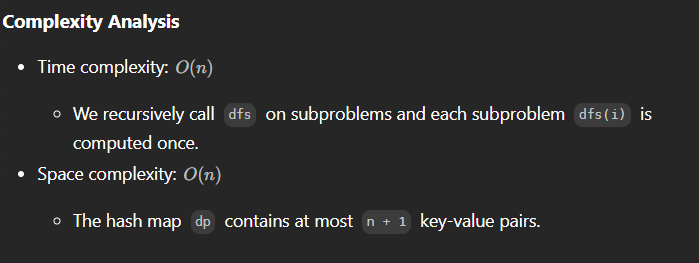

# 1137. N-th Tribonacci Number

- if just using recurrsion, will exceed time limit

## Appraoch 1 DP topdown + HashMap

```java
class Solution {
    private Map<Integer, Integer> dp = new HashMap<>(){{
            put(0, 0);
            put(1, 1);
            put(2, 1);
    }};

    public int tribonacci(int n) {
        return dfs(n);
    }

    public int dfs(int n) {
        if (dp.containsKey(n)) {
            return dp.get(n);
        }

        int answer = dfs(n-1) + dfs(n-2) + dfs(n-3);
        dp.put(n, answer);
        return answer;
    }
}

```




## Approach 2 - DP bottom up

```java
class Solution {
    public int tribonacci(int n) {
        if (n < 3) {
            return n > 0 ? 1 : 0;
        }
        
        int[] dp = new int[n + 1];
        dp[1] = 1;
        dp[2] = 1;
        
        for (int i = 3; i <= n; ++i) {
            dp[i] = dp[i - 1] + dp[i - 2] + dp[i - 3];
        }
        
        return dp[n];
    }
}
```