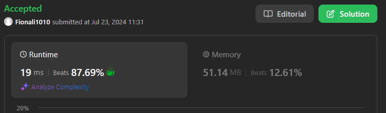
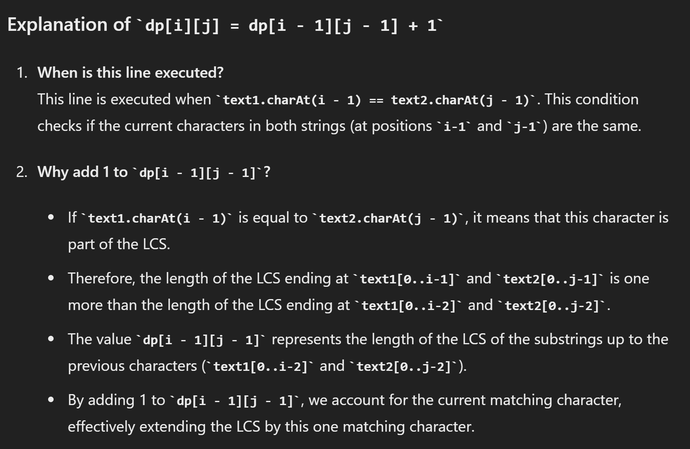
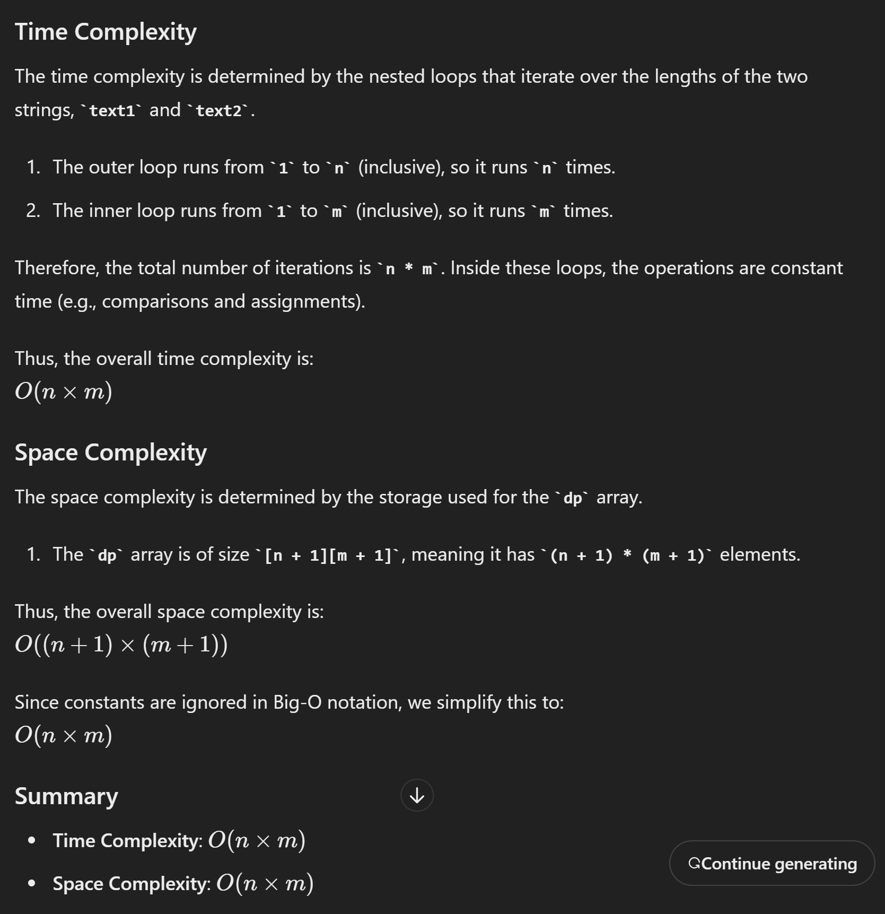

# 1143. Longest Common Subsequence

## Approach dp
- dp的长和宽度比strings各多一位， 这样避免出界
- 第一列和第一行都是0
- 考虑两种情况



```java
class Solution {
    public int longestCommonSubsequence(String text1, String text2) {
        int n = text1.length();
        int m = text2.length();

        // state
        int[][] dp = new int[n + 1][m + 1]; 

        // function
        for (int i = 1; i <= n; i++) {
            for (int j = 1; j <= m; j++) {
                if (text1.charAt(i - 1) == text2.charAt(j - 1)) {
                    dp[i][j] = dp[i - 1][j - 1] + 1; // 加对角线上的数字
                } else {
                    dp[i][j] = Math.max(dp[i - 1][j], dp[i][j - 1]); //左边和上边选一个大的
                }
            }
        }

        // answer
        return dp[n][m];
    }
}

```



