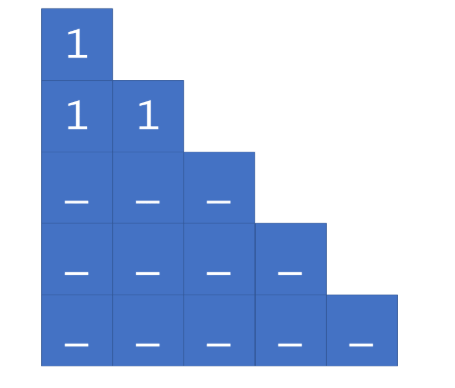
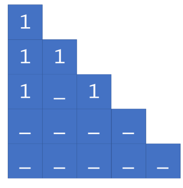
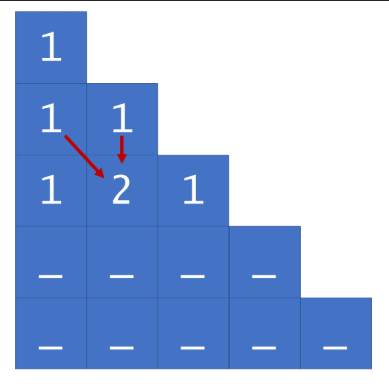

# 118. Pascal's Triangle





## Approach
- 每一行先填左边再填右边最后中间的数

```java
class Solution {
    public List<List<Integer>> generate(int numRows) {
        List<List<Integer>> triangle = new ArrayList<>();
        
        // base case: 1st row is always 1
         triangle.add(new ArrayList<>(Arrays.asList(1)));

        for (int i = 1; i < numRows; i++) {
            List<Integer> row = new ArrayList<>();
            List<Integer> preRow = triangle.get(i-1); //[1]
            
            // first element always 1
            row.add(1);

            // Each triangle element (other than the first and last of each row)
            // is equal to the sum of the elements above-and-to-the-left and
            // above-and-to-the-right.
            for (int j = 1; j < i; j++) {
                row.add(preRow.get(j - 1) + preRow.get(j));
            }

            // last element always 1
            row.add(1);
        
            triangle.add(row);
        }
        return triangle;
    }
}
```