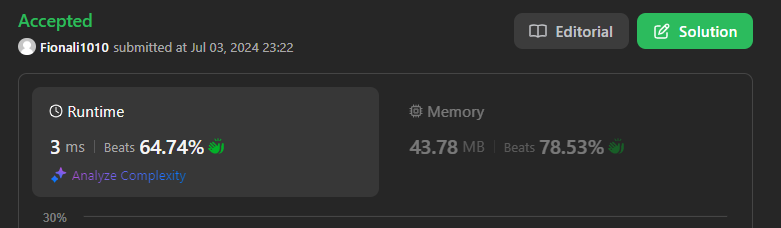
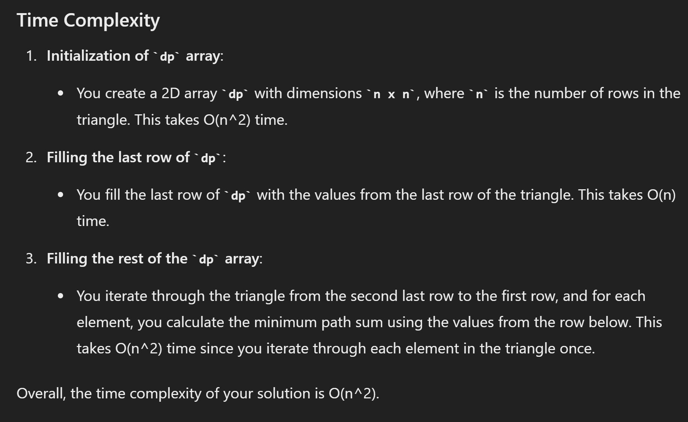
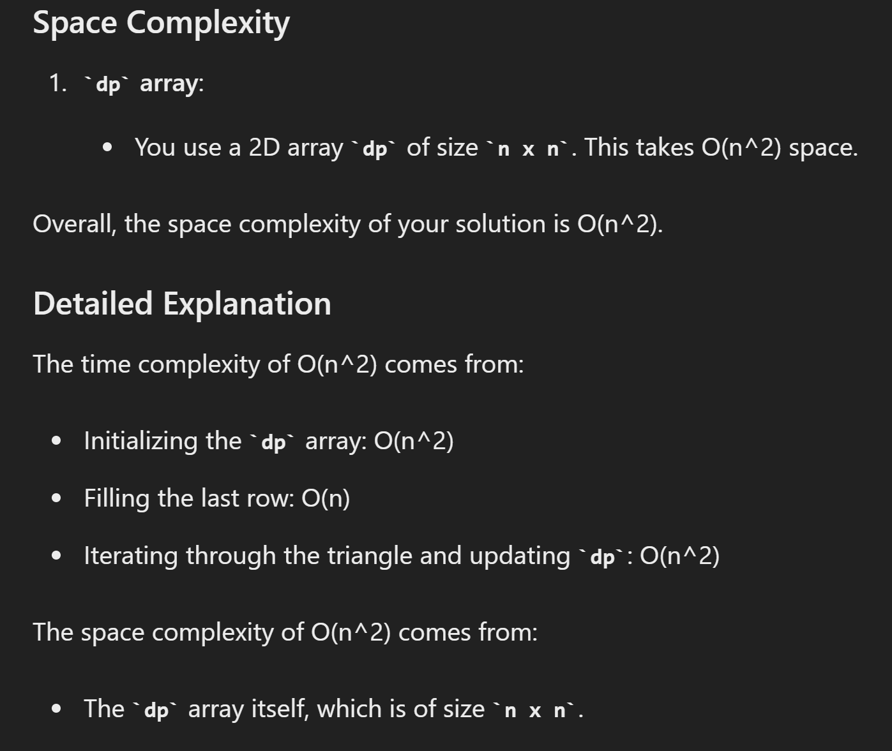
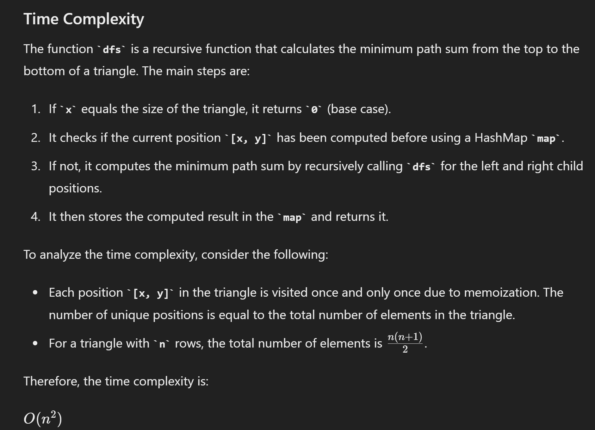
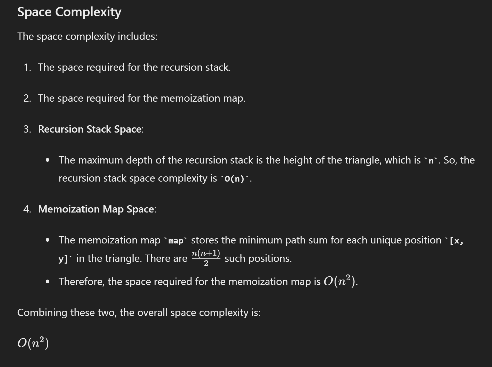

# 120.Triangle

## approach 1 - bottom up



```java
class Solution {
    public int minimumTotal(List<List<Integer>> triangle) {
        int n = triangle.size();
        int[][] dp = new int[n][];

        // dp代表状态
        for (int i = 0; i < n; i++) {
            dp[i] = new int[i+1];
        }

        // 初始化： 终点
        for (int i = 0; i < n; i++) {
            dp[n-1][i] = triangle.get(n-1).get(i);
        }

        for (int i = n-2; i >=0; i--) {
            for (int j = 0; j <= i; j++) {
                //方程：到哪去
                dp[i][j] = triangle.get(i).get(j)+ Math.min(dp[i+1][j], dp[i+1][j+1]);
            }
        }

        // 答案： 起点
        return dp[0][0];
    }
}
```





## approach 2 


```java

class Solution {
    public int minimumTotal(List<List<Integer>> triangle) {
        int n = triangle.size();
        int[] dp = new int[n];

        for (int i = 0; i < n; i++) {
            dp[i] = triangle.get(n-1).get(i);
        }

        for (int row = n-2; row >=0; row--) {
            for (int col = 0; col <= row; col++) {
                dp[col] = triangle.get(row).get(col)+ Math.min(dp[col], dp[col+1]);
            }
        }

        return dp[0];
    }
}

```

This optimized version maintains the same O(n^2) time complexity but reduces the space complexity to O(n).

## approach 3 - up to bottom


```java
class Solution {
    public int minimumTotal(List<List<Integer>> triangle) {
        if (triangle == null || triangle.size() == 0) {
            return 0;
        }
        
        int n = triangle.size();
        int[][] dp = new int[n][];
        
        // Initialize the dp array to have the same structure as the triangle
        for (int i = 0; i < n; i++) {
            dp[i] = new int[i + 1];
        }
        
        // Initialize the first element
        dp[0][0] = triangle.get(0).get(0);
        
        // Fill the dp array
        for (int i = 1; i < n; i++) {
            // Leftmost element of each row
            dp[i][0] = dp[i - 1][0] + triangle.get(i).get(0);
            // Fill the middle elements
            for (int j = 1; j < i; j++) {
                dp[i][j] = triangle.get(i).get(j) + Math.min(dp[i - 1][j - 1], dp[i - 1][j]);
            }
            // Rightmost element of each row
            dp[i][i] = dp[i - 1][i - 1] + triangle.get(i).get(i);
        }
        
        // Find the minimum path sum in the last row
        int minTotal = dp[n - 1][0];
        for (int i = 1; i < n; i++) {
            minTotal = Math.min(minTotal, dp[n - 1][i]);
        }
        
        return minTotal;
    }
}
```

## Approach 4 - divide & conque + HashMap

```java
class Solution {
    public int minimumTotal(List<List<Integer>> triangle) {
        HashMap<List<Integer>, Integer> map = new HashMap<>();
        return dfs(triangle, 0, 0, map);
    }

    public int dfs(List<List<Integer>> triangle, int x, int y, HashMap<List<Integer>, Integer> map) {
        if (x == triangle.size()) {
            return 0;
        }

        List<Integer> cur = new ArrayList<>(Arrays.asList(x, y));
        if (map.containsKey(cur)) {
            return map.get(cur);
        }

        int left = dfs(triangle, x+1, y, map);
        int right = dfs(triangle, x+1, y+1, map);
       
        map.put(cur, Math.min(left, right) + triangle.get(x).get(y));
        return map.get(cur); 
    }
}

```



