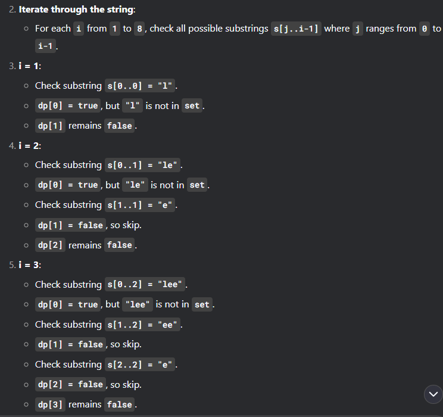
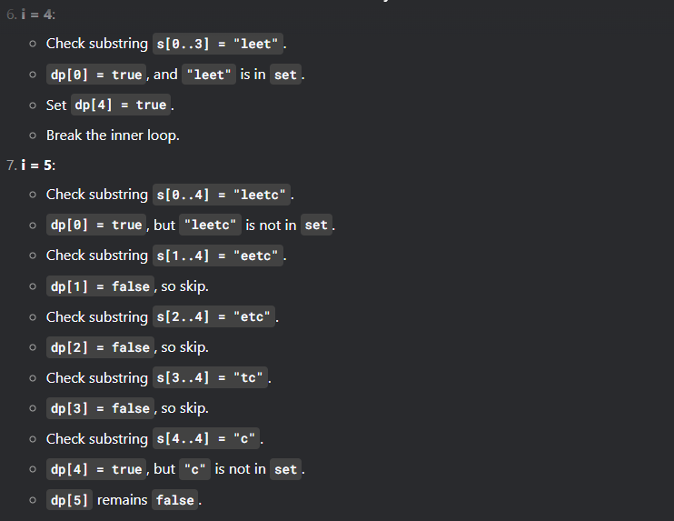
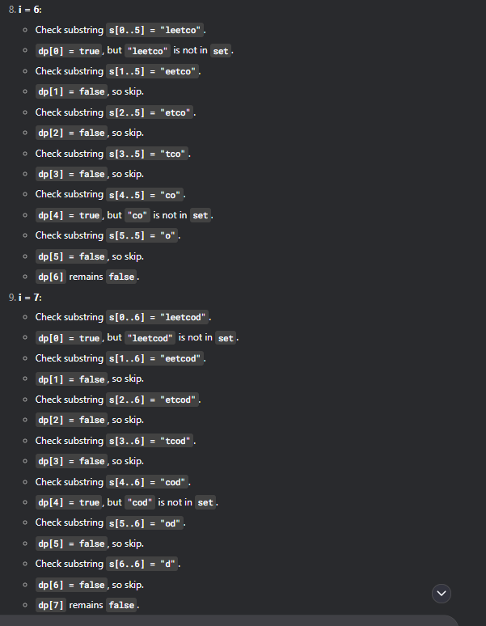
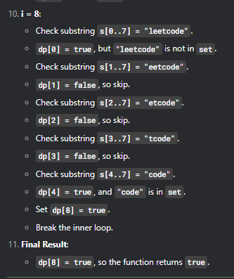

# 139 Word Break

## Appraoch 1 - bottom up DP

```java
class Solution {
    public boolean wordBreak(String s, List<String> wordDict) {
        int n = s.length();
        Set<String> set = new HashSet<>(wordDict);
        
        // 1. state: dp[i] 表示前i个数, 即s[0, i)是否可以拆分成若干字典里的单词
        boolean[] dp = new boolean[n + 1]; // +1因为包含了空串, 这是一种套路
        
        // 2. init: 
        // s[0, 0) 表示空串，我们规定空串可以被拆分 (任何字符串都以空串开头)，dp[0] = true
        dp[0] = true;

        // 3. function:
        // dp[i] = or dp[j] && s.substring[j, i]在字典里， 0 <= j < i 
            // dp[j] is true ==> s[0:j) 可以被拆分成字典里的单词
            // s[j:i）在w字典里.
        // If both conditions are met, dp[i] = true and break inner loop， 找个一个满足的就可以
        for (int i = 1; i <= n; i++) {
            for (int j = 0; j < i; j++) {
                if (dp[j] && set.contains(s.substring(j, i))) {
                    dp[i] = true;
                    break; // removing break is also ok
                }
            }
        }
        // 4. answer：s[0, n), 即前n个字符能不能被拆分成字典里的单词
        return dp[n];
    }
}
```
- time O(N^2)
- space O(N)

- walk through - 
    - input: s = "leetcode", wordDict = ["leet","code"]





## Approach 2 - DP 剪枝 （最优解）

```java
class Solution {
    public boolean wordBreak(String s, List<String> wordDict) {
        // 1. 找出字典中长度最长的单词
        int maxLen = 0;
        for (String word : wordDict) {
            maxLen = Math.max(maxLen, word.length());
        }
        Set<String> words = new HashSet<>(wordDict);

        // 2. DP         
        int n = s.length();
        boolean[] dp = new boolean[n + 1];
        dp[0] = true;
        
        for (int i = 1; i <= n; i++) {
            for (int j = i - 1; j >= Math.max(i - maxLen, 0); j--) {
                if (dp[j] && words.contains(s.substring(j, i))) {
                    dp[i] = true;
                    break;
                }
            }
        }
        return dp[n];
    }
}
```