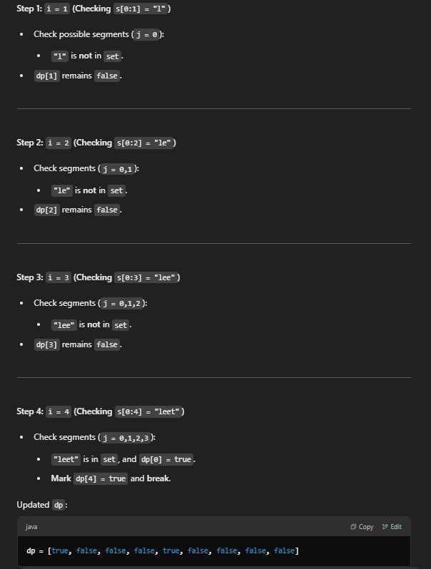
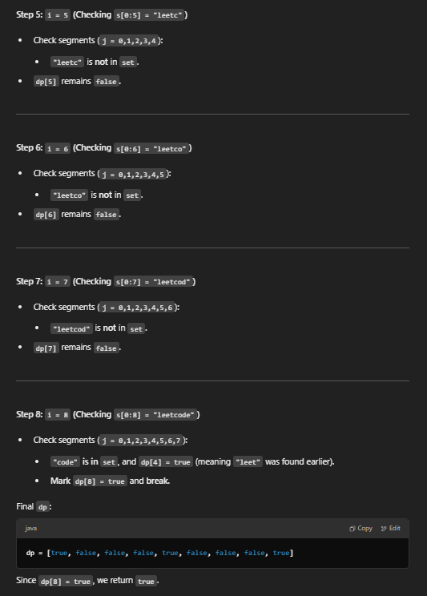

# 139 Word Break

## Appraoch 1 - bottom up DP

```java
class Solution {
    public boolean wordBreak(String s, List<String> wordDict) {
        // 1. state: dp[i] means if s[0:i] can be formed using words in wordDict
        int n = s.length();
        Set<String> set = new HashSet<>(wordDict);
        boolean[] dp = new boolean[n + 1];
        
        // 2. init: if s[0:0] can be formed, true as Empty string is always a valid segmentation
        dp[0] = true;

        // 3. function:
        // We iterate through all possible segmentations s[j:i] and check:
            // If dp[j] is true (meaning s[0:j] can be formed).
            // If s[j:i] exists in the wordDict.
        // If both conditions are met, we mark dp[i] = true and break out of the loop.
        for (int i = 1; i <= n; i++) {
            for (int j = 0; j < i; j++) {
                if (dp[j] && set.contains(s.substring(j, i))) {
                    dp[i] = true;
                    break;
                }
            }
        }
        // 4. answer
        return dp[n];
    }
}
```
- time O(N^2)
- space O(N)

- walk through

