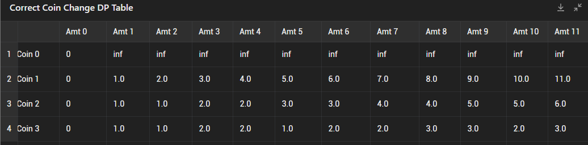

# 322. Coin Change

- approach DP

```java
class Solution {
    public int coinChange(int[] coins, int amount) {
        // state: minimum number of coins needed to make up the amount j using the first i coins.
        int n = coins.length;
        int[][] dp = new int[n+1][amount + 1];

        // initialzation
        for (int i = 0; i <= n; i++) {
            Arrays.fill(dp[i], Integer.MAX_VALUE);
            dp[i][0] = 0;
        }

        for (int i = 1; i <= n; i++) {
            for (int j = 0; j <= amount; j++) {
                if (j >= coins[i-1] && dp[i][j - coins[i - 1]] != Integer.MAX_VALUE) {
                    dp[i][j] = Math.min(
                        dp[i-1][j], // Carry over the value from the previous row
                        dp[i][j - coins[i-1]] + 1); //use the current coin and add 1 to the result for the remaining amount.
                } else {
                    dp[i][j] = dp[i-1][j]; // cannot use the current coin
                }
            }
        }

        return dp[n][amount] == Integer.MAX_VALUE? -1: dp[n][amount]; 
    }
}
```
- test case: 
    - Input: coins = [1,2,5], amount = 11
    - Output: 3
    - Explanation: 11 = 5 + 5 + 1
