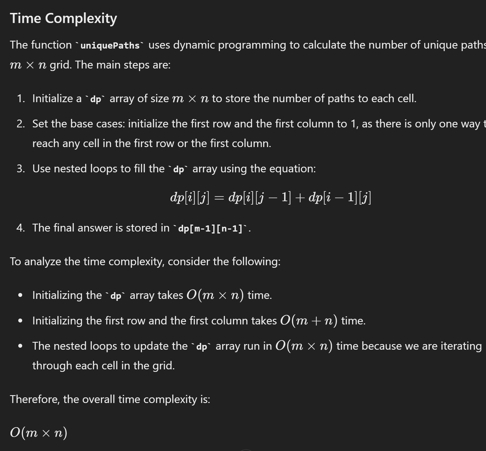
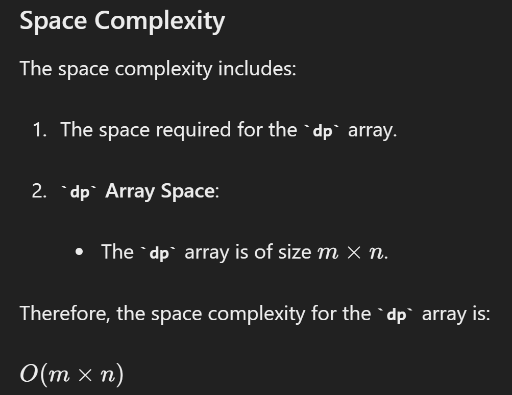

# Unique Paths

## Approach 1 - top down


```java
class Solution {
    public int uniquePaths(int m, int n) {
        // state, dp[i][j] means No.of paths
        int[][] dp = new int[m][n];

        // initialize row 0 and col 0;
        for (int i = 0; i < m; i++) {
            dp[i][0] = 1;
        }

        for (int j = 0; j < n; j++) {
            dp[0][j] = 1;
        }

        // function
        for (int i = 1; i < m; i++) {
            for (int j = 1; j < n; j++) {
                dp[i][j] = dp[i][j-1] + dp[i-1][j];
            }
        }

        // answer
        return dp[m-1][n-1];
    }
}
```





## Approach 2 - bottom up

```java
class Solution {
    public int uniquePaths(int m, int n) {
        // state, dp[i][j] means i,j 走到最顶层的方案数
        int[][] dp = new int[m][n];

        // initialize row 0 and col 0;
        for (int i = 0; i < m; i++) {
            dp[i][n-1] = 1;
        }

        for (int j = 0; j < n; j++) {
            dp[m-1][j] = 1;
        }

        // function
        for (int i = m-2; i >= 0; i--) {
            for (int j = n-2; j >= 0; j--) {
                dp[i][j] = dp[i+1][j] + dp[i][j+1];
            }
        }

        // answer
        return dp[0][0];
    }
}
```