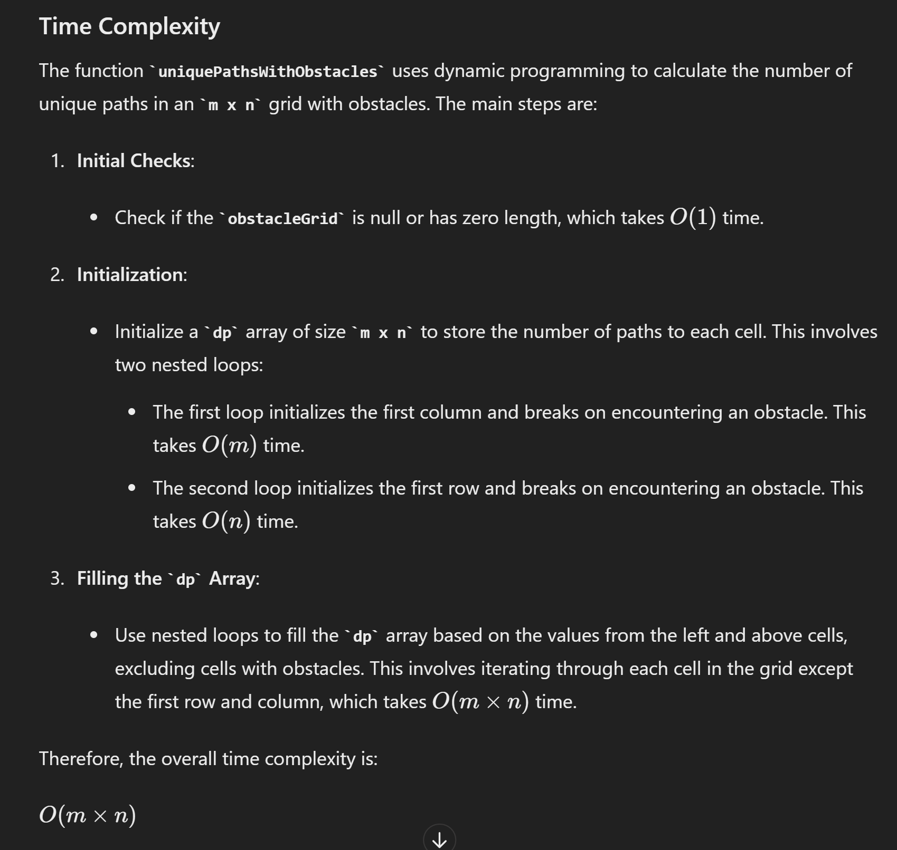
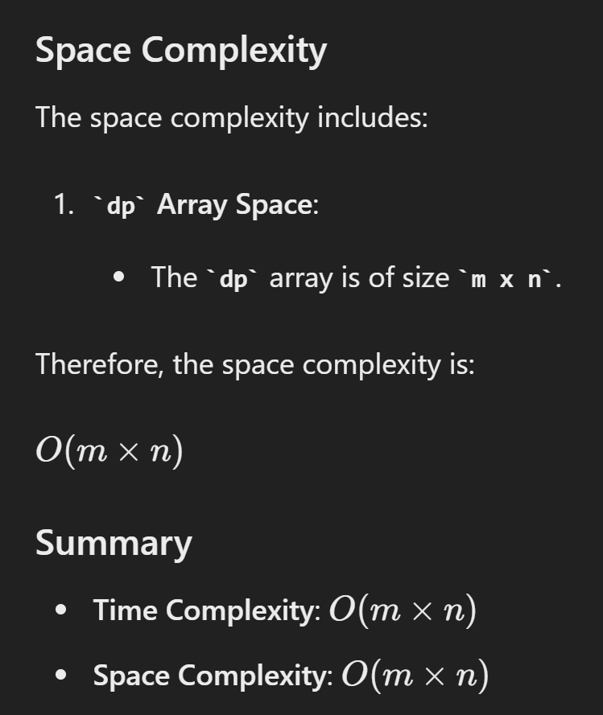

# 63. Unique Paths II

## approach - dp top down

```java
// 第一种写法
class Solution {
    public int uniquePathsWithObstacles(int[][] obstacleGrid) {
        // state
        if (obstacleGrid == null || obstacleGrid.length == 0) {
            return 0;
        }

        int m = obstacleGrid.length;
        int n = obstacleGrid[0].length;
        int[][] dp = new int[m][n];

        // initialization
        for (int i = 0; i < m; i++) {
            if (obstacleGrid[i][0] == 1) {
                break;
            }
            dp[i][0] = 1;
        }

        for (int j = 0; j < n; j++) {
            if (obstacleGrid[0][j] == 1) {
                break;
            }
            dp[0][j] = 1; 
        }

        // dp function
        for (int i = 1; i < m; i++) {
            for (int j = 1; j < n; j++) {
                if (obstacleGrid[i][j] == 1){
                   continue;
                } 
                dp[i][j] = dp[i][j-1] + dp[i-1][j];
            }
        }
        return dp[m-1][n-1];
    }
}

// 第二种写法
class Solution {
    public int uniquePathsWithObstacles(int[][] obstacleGrid) {
        int m = obstacleGrid.length, n = obstacleGrid[0].length;
        int[][] dp = new int[m][n];

        // state: dp[i][j] means sum of paths to i,j
        dp[0][0] = obstacleGrid[0][0] == 1? 0: 1;

        // initialization: first row and first col
        for (int j = 1; j < n; j++) {
            dp[0][j] = obstacleGrid[0][j] == 1? 0: dp[0][j-1];
        }

        for (int i = 1; i < m; i++) {
            dp[i][0] = obstacleGrid[i][0] == 1? 0: dp[i-1][0];
        }

        // function
        for (int i = 1; i < m; i++) {
            for (int j = 1; j < n; j++) {
                dp[i][j] = obstacleGrid[i][j] == 1? 0: dp[i-1][j] + dp[i][j-1];
            }
        }

        return dp[m-1][n-1];
    }
}
```



