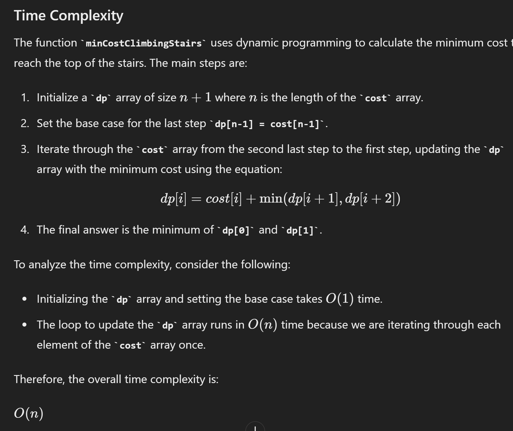
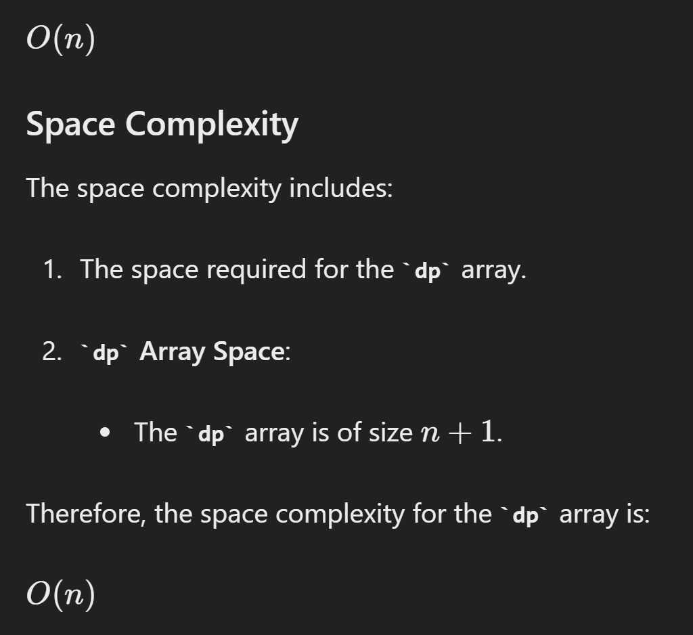

# 746.Min Cost Climbing Stairs

## Approach dp - bottom up

[tutorial]()

```java
class Solution {
    public int minCostClimbingStairs(int[] cost) {
        int n = cost.length;
        int[] dp = new int[n+1];
        dp[n-1] = cost[n-1];

        for (int i = n-2; i >= 0; i--) {
            dp[i] = cost[i] + Math.min(dp[i+1], dp[i+2]);
        }

        return Math.min(dp[0], dp[1]);
    }
}

```




## Aproach 2 - space optimized

```java
class Solution {
    public int minCostClimbingStairs(int[] cost) {
        int n = cost.length;
        int dp1 = 0;
        int dp2 = 0;

        for (int i = n - 1; i >= 0; i--) {
            int current = cost[i] + Math.min(dp1, dp2);
            dp2 = dp1;
            dp1 = current;
        }

        return Math.min(dp1, dp2);
    }
}

```