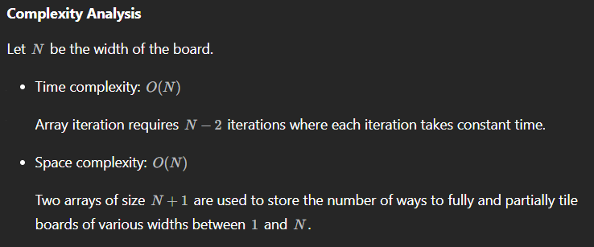

# 790. Domino and Tromino Tiling

## Approach 1 - DP

```java
class Solution {
    public int numTilings(int n) {
        int MOD = 1_000_000_007;
        // handle base case scenarios
        if (n <= 2) {  
            return n;
        }
        // f[k]: number of ways to "fully cover a board" of width k
        long[] f = new long[n + 1];  
        // p[k]: number of ways to "partially cover a board" of width k
        long[] p = new long[n + 1];  
        // initialize f and p with results for the base case scenarios
        f[1] = 1L;
        f[2] = 2L;
        p[2] = 1L;
        for (int k = 3; k < n + 1; ++k) {
            f[k] = (f[k - 1] + f[k - 2] + 2 * p[k - 1]) % MOD;
            p[k] = (p[k - 1] + f[k - 2]) % MOD;
        }
        return (int) (f[n]);
    }
}
```

