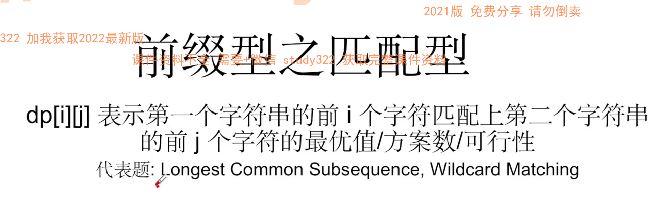

# DP Notes

## DP 4 factors


## DP 适用场景

- 求最值， max / min
- 求可行性， 是否存在一种方案，return boolean
- 求方案总数， 只求总数不求具体方案
- 求具体方案， 用DFS
- 不可以有循环依赖，有方向性


- 前三类考得很多
- 一定要找对题型， 才好定义state

## 常见题型state 定义





## 面试考得很多 - 背包型dp

### 01 背包
- 定义：给出n个物品及其大小 问是否能挑选出一些物品装满大小为m的背包
    - e.g. 2, 3, 5, 7 四个物品，m = 11, 选2+3+5 or 3+7, 挑在 <= m 情况下尽可能大的组合
    - 可能问能不能装满（可行性）， 另一张问法是尽可能装满/最多能装多满 （最优值）
    - m 代表数值求和的概念
- 什么是01 背包： 每个物品要么挑0个要么挑1个
    - 如果一个物品可以被分割，就不是01背包
    - 如果一个物品可以选多份，就叫多重背包
- dp[i][j]: 前i个物品里挑出若干物品组成和为j的大小是否可行
    - 关键点： 前 & sum 
    - j 表示数值，表示sum

#### 例题1 - 背包

n个物品，大小为m的包，最多能装多满
test case: 
arr = [3,4,8,5], backpack size = 10, 
output: 9, 4+5 = 9

```java


```