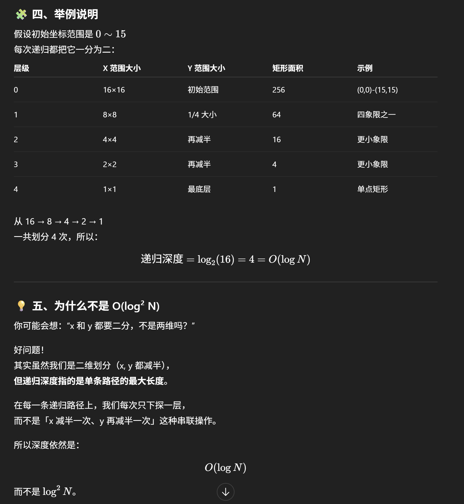

# 1274. Number of Ships in a Rectangle





##  思路理解

乍一看这道题很复杂，但其实它的解法是比较直接的。

当你看到题目的图时，它是一个 **二维平面 (2D)**。题目告诉我们海上最多可能有上百万个格子（一个 million 的坐标点），  
同时我们只能调用 **`hasShips()`** 这个 API 限定次数（最多 400 次），去判断某个矩形区域内是否有船。  
因此我们不可能暴力地对所有格子都发请求。


##  直觉启发

当你看到这样的场景，自然的想法就是：

> “我只去搜索那些可能有船的区域，把没有船的区域都排除掉。”

所以，这道题的核心思想其实就是一种 **剪枝 (Pruning)** 思想。

这让人联想到 **二分查找 (Binary Search)** ——  
不过本题是 **二维的搜索空间 (2D Search Space)**，  
因此更像是一个 **2D 版的二分搜索** 或者说 **二维分治法 (2D Divide & Conquer)**。


## 核心思路

我们用 **DFS（深度优先搜索）** 来递归地探索这个矩形区域。

在递归时要明确两个 **base case（出口条件）**：

1. **Base Case 1：检查是否有船**  
   - 调用 `hasShips(topRight, bottomLeft)`。  
   - 如果这个区域没有船，直接返回 `0`。  
   - 因为我们不再需要继续细分空区域。

2. **Base Case 2：单点情况**  
   - 如果当前矩形缩小到只有一个点（`x1 == x2 && y1 == y2`），  
   - 根据题意，一个点最多只有一艘船。  
   - 因此如果 `hasShips()` 为真，就返回 `1`。

⚠️ 注意：
> Base Case 的顺序必须是先判断 “有没有船”，再判断 “是否是单点”。  
> 否则如果这个点其实是空的，但因为是单点直接返回 `1`，就会出错。


## 分治划分（Divide into 4 Quadrants）

当当前区域既不是空的、也不是单点时，  
我们就把这个大矩形划分为 **4 个小矩形（象限）**：


```java
class Solution {
    public int countShips(Sea sea, int[] topRight, int[] bottomLeft) {
        int x1 = bottomLeft[0], y1 = bottomLeft[1];
        int x2 = topRight[0], y2 = topRight[1];

        // 无效边界
        if (x1 > x2 || y1 > y2) return 0;

        // base case 1: 没有船 (base case 1 必须在base case 2前面 不然没有船也返回1就错了)
        if (!sea.hasShips(topRight, bottomLeft)) return 0;

        // base case 2: 单个点且有船
        if (x1 == x2 && y1 == y2) return 1;

        int midX = (x1 + x2) / 2;
        int midY = (y1 + y2) / 2;

        int count = 0;

        // 左下
        count += countShips(sea, new int[]{midX, midY}, new int[]{x1, y1});
        // 左上
        count += countShips(sea, new int[]{midX, y2}, new int[]{x1, midY + 1});
        // 右下
        count += countShips(sea, new int[]{x2, midY}, new int[]{midX + 1, y1});
        // 右上
        count += countShips(sea, new int[]{x2, y2}, new int[]{midX + 1, midY + 1});

        return count;
    }
}
```

