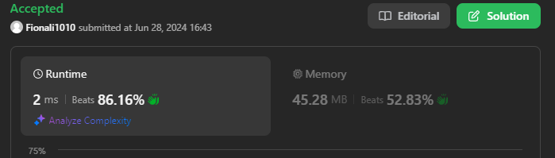
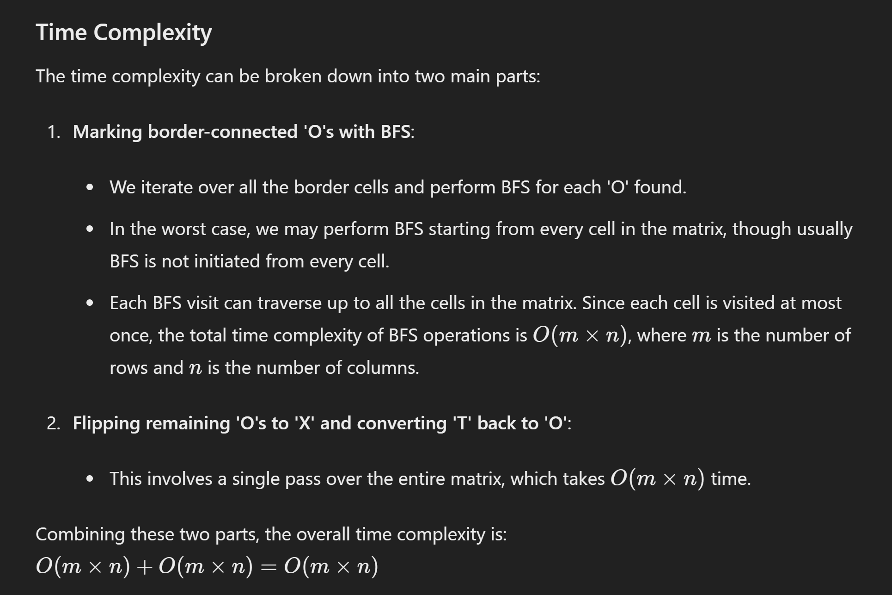
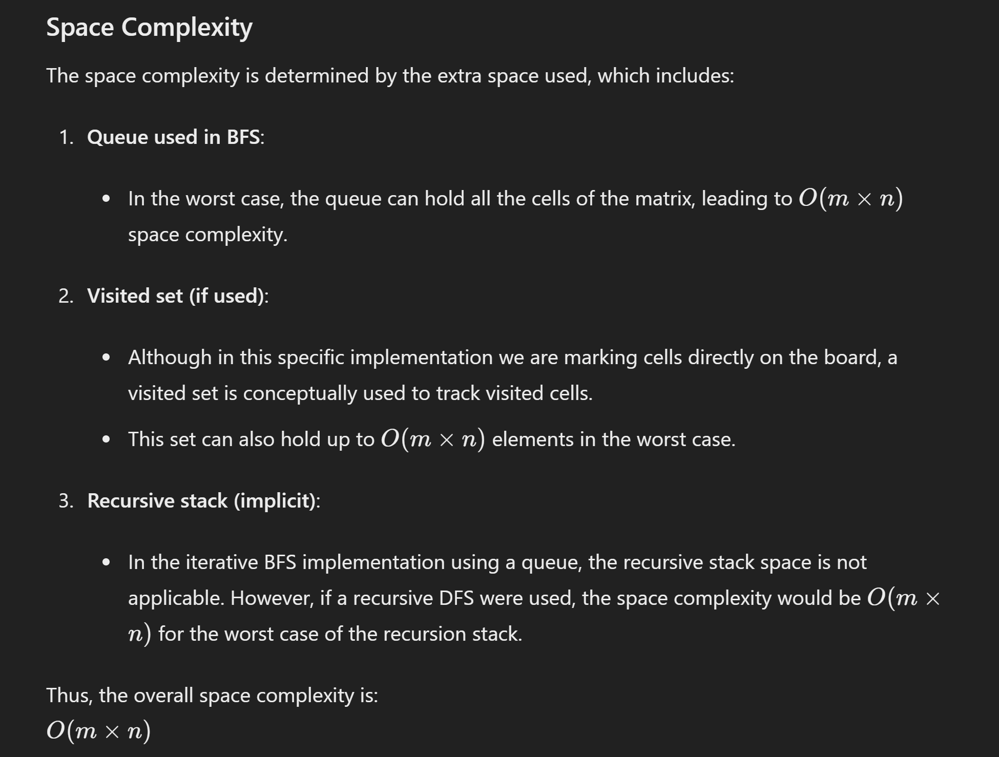

# 130. Surrounded Regions



[tutoria](https://www.youtube.com/watch?v=9z2BunfoZ5Y)

```java
class Solution {
    int rows;
    int cols;
    int[][] dirs = {{1, 0}, {-1, 0}, {0, 1}, {0, -1}};
    
    public void solve(char[][] board) {
        rows = board.length;
        cols = board[0].length;

        for (int i = 0; i < rows; i++) {
            if (board[i][0] == 'O') bfs(board, i, 0);
            if (board[i][cols-1] == 'O') bfs(board, i, cols-1);
        }

        for (int j = 0; j < cols; j++) {
            if (board[0][j] == 'O') bfs(board, 0, j);
            if (board[rows-1][j] == 'O') bfs(board, rows-1, j);
        }

        for (int i = 0; i < rows; i++) {
            for (int j = 0; j < cols; j++) {
                if (board[i][j] == 'O') {
                    board[i][j] = 'X';
                } else if (board[i][j] == 'T') {
                    board[i][j] = 'O';
                }
            }
        }

    }

    public void bfs(char[][] board, int row, int col) {
        Deque<int[]> que = new ArrayDeque<>();
        board[row][col] = 'T'; //very important
        que.add(new int[] {row, col});

        while (!que.isEmpty()) {
            int[] node = que.poll();
            row = node[0];
            col = node[1];

            for (int[] dir: dirs) {
                int newRow = row + dir[0];
                int newCol = col + dir[1];

                if (0 <= newRow && newRow < rows && newCol < cols && 0 <= newCol && board[newRow][newCol] == 'O') {
                    board[newRow][newCol] = 'T';
                    que.add(new int[] {newRow, newCol});
                }
            }
        }
    } 
}

```


