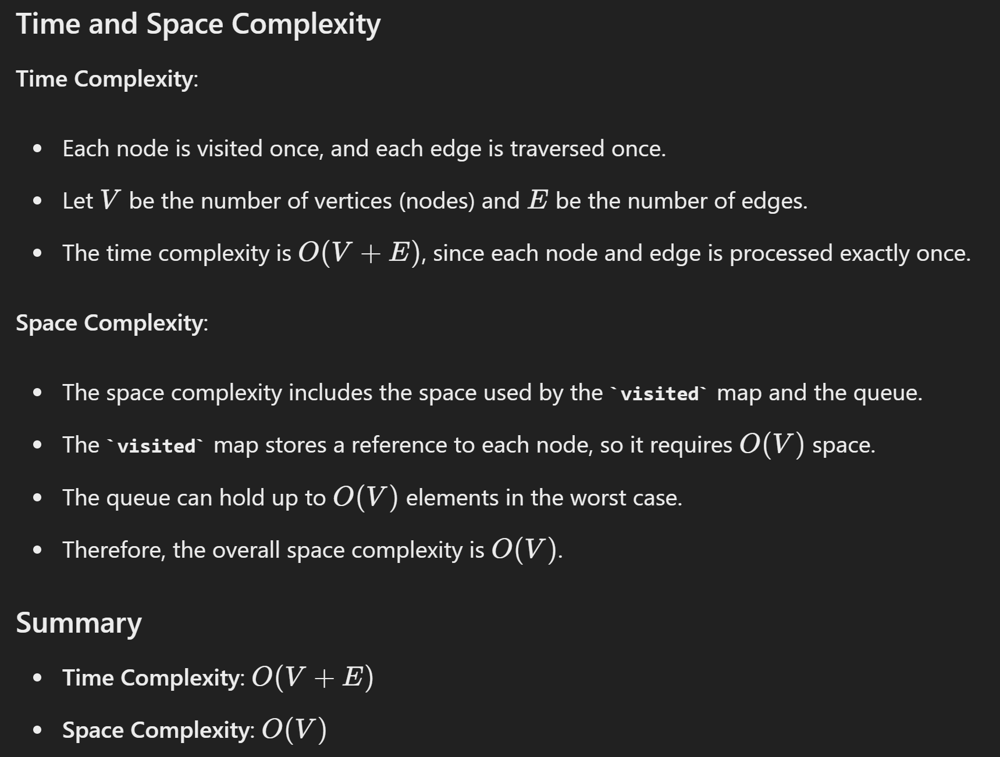

# 133. Clone Graph

## Approach 1 - BFS

```java
class Solution {
    public Node cloneGraph(Node node) {
        if (node == null) return null;

        HashMap<Node, Node> visited = new HashMap<>();
        visited.put(node, new Node(node.val));

        Deque<Node> que = new ArrayDeque<>();
        que.offer(node);

        while (!que.isEmpty()) {
            Node cur = que.poll();

            for (Node neighbor: cur.neighbors) {
                if (!visited.containsKey(neighbor)) {
                    visited.put(neighbor, new Node(neighbor.val));
                    que.offer(neighbor);
                }
                visited.get(cur).neighbors.add(visited.get(neighbor));
            }
        }
        return visited.get(node);
    }
}
```

