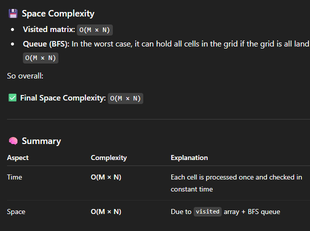
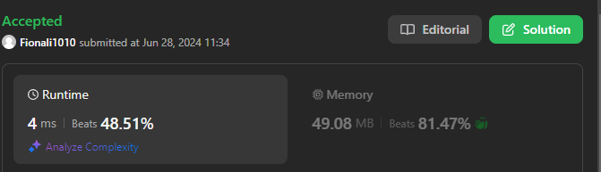
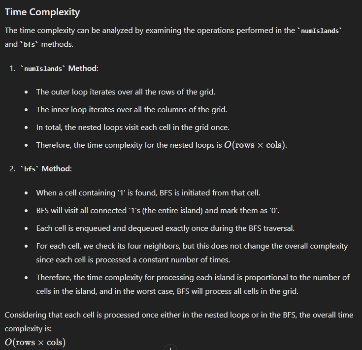
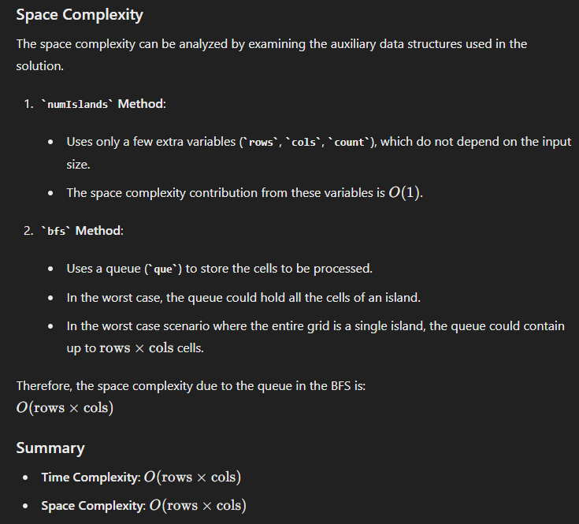

# 200. Number of Islands

## approach 1



```java
class Solution {
    int rows;
    int cols;
    int[][] steps = {{-1, 0}, {1, 0}, {0, -1}, {0, 1}};

    public int numIslands(char[][] grid) {
        if (grid == null || grid.length == 0 || grid[0] == null || grid[0].length == 0) {
            return 0;
        }

        rows = grid.length;
        cols = grid[0].length;
        boolean[][] visited = new boolean[rows][cols];
        int count = 0;

        for (int i = 0; i < rows; i++) {
            for (int j = 0; j < cols; j++) {
                if (grid[i][j] == '1' && !visited[i][j]) {
                    count++;
                    bfs(grid, i, j, visited);
                } 
            }
        }

        return count;
    }
    
    private void bfs(char[][] grid, int i, int j, boolean[][] visited) {
        Deque<int[]> que = new ArrayDeque<>();
        que.offer(new int[]{i, j});
        visited[i][j] = true;

        while (!que.isEmpty()) {
            int[] node = que.poll();
            int row = node[0];
            int col = node[1];

            for (int[] step: steps) {
                int newRow = row + step[0];
                int newCol = col + step[1];

                if (isValid(grid, newRow, newCol, visited)) {
                    que.offer(new int[]{newRow, newCol});
                    visited[newRow][newCol] = true;
                }            
            }
        }
    }

    private boolean isValid(char[][] grid, int row, int col, boolean[][] visited) {
        return (row >= 0 && row < rows && col >= 0 && col < cols && !visited[row][col] && grid[row][col] == '1');
    }

}
```

## 压缩二维坐标到一维
```java
class Solution {
    public int numIslands(char[][] grid) {
       // 0. 判断grid
       if (grid == null || grid.length == 0 || grid[0] == null || grid[0].length == 0) return 0;
       
        // 1. 定义数据
        HashSet<Integer> visited = new HashSet<>();

        int n = grid.length;
        int m = grid[0].length;
        int count = 0;

        for (int i = 0; i < n; i++) {
            for (int j = 0; j < m; j++) {
                if (!visited.contains(i * m + j) && grid[i][j] == '1') {
                    count += 1;
                    bfs(grid, i, j, visited);
                }
            }
        } 

        return count;       
    }

    private void bfs(char[][] grid, int i, int j, HashSet<Integer> visited) {
        Deque<Integer> que = new ArrayDeque<>();
        int m = grid[0].length;
        que.offer(i * m + j);
        visited.add(i * m + j);
        int[] dx = {1, -1, 0, 0};
        int[] dy = {0, 0, 1, -1};

        while (!que.isEmpty()) {
            int cur = que.poll();
            int x = cur / m;
            int y = cur % m;

            for (int k = 0; k < 4; k++) {
                int newX = x + dx[k];
                int newY = y + dy[k];

                if (isValid(grid, newX, newY, visited)) {
                    que.offer(newX * m + newY);
                    visited.add(newX * m + newY);
                }
            }
        }
    }
    
    private boolean isValid(char[][] grid, int x, int y, HashSet<Integer> visited) {
        if (x < 0 || y < 0 || x >= grid.length || y >= grid[0].length) return false;
        if (visited.contains(x * grid[0].length + y)) return false;
        if (grid[x][y] != '1') return false;
        return true; 
    }
}
```

## approach 2
- 这个approach缺点是改了原数据，需要confirm with Interviewer, 是否允许我们改动grid



```java
class Solution {
    int rows;
    int cols;
    int[][] steps = {{1, 0}, {-1, 0}, {0, 1}, {0, -1}};

    public int numIslands(char[][] grid) {
        if (grid == null || grid.length == 0 || grid[0] == null || grid[0].length == 0) return 0;
        rows = grid.length;
        cols = grid[0].length;
        int count = 0;
        
        for (int i = 0; i < rows; i++) {
            for (int j = 0; j < cols; j++) {
                if (grid[i][j] == '1') {
                    count++;
                    bfs(grid, i, j);
                } 
            }
        }

        return count;
    }

    public void bfs(char[][] grid, int i, int j) {
        Deque<int[]> que = new ArrayDeque<>();
        que.offer(new int[] {i, j});
        grid[i][j] = 0;

        while (!que.isEmpty()) {
            int[] node = que.poll();
            int row = node[0];
            int col = node[1];

            for (int[] step: steps) {
                int newRow = row + step[0];
                int newCol = col + step[1];
                if ( 0 <= newRow && newRow < rows && 0 <= newCol && newCol < cols && grid[newRow][newCol] == '1') {
                   que.offer(new int[]{newRow, newCol});
                   grid[newRow][newCol] = '0';
                }
            }
        }


    }
}
```






## Approach 3 - DFS

```java
class Solution {
    int n;
    int m;

    public int numIslands(char[][] grid) {
        n = grid.length;
        m = grid[0].length;
        boolean[][] visited = new boolean[n][m];
        int count = 0;

        for (int i = 0; i < n; i++) {
            for (int j = 0; j < m; j++) {
                if (grid[i][j] == '1' && !visited[i][j]) {
                    count++;
                    dfs(grid, visited, i, j);
                }
            }
        }

        return count;
    }

    private void dfs(char[][] grid, boolean[][] visited, int row, int col) {
        if (row < 0 || row >= n || col < 0 || col >= m || grid[row][col] == '0'|| visited[row][col]) {
            return;
        }
        visited[row][col] = true;
        dfs(grid, visited, row, col+1);
        dfs(grid, visited, row, col-1);
        dfs(grid, visited, row+1, col);
        dfs(grid, visited, row-1, col);
    }
}
```