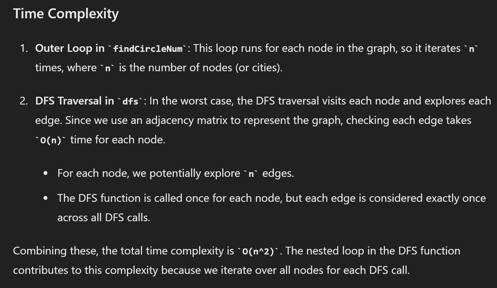
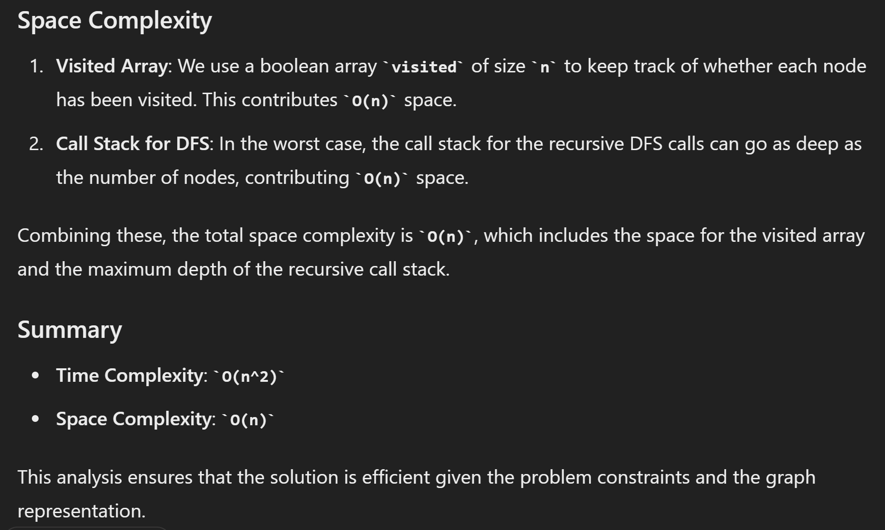

# 547. Number of Provinces

## Approach 1 - DFS


- 这道题和num of islands 是不一样 (i, j) 不是代表一个城市而是代表两个城市之间的edge
- 总共只有 isConnected.length 个城市
- 只要这个城市没有被访问过我们就res++, 同时记录一下该城市已经被访问过 同时我们也要通过edge去访问连接的城市并记录
- 只有没有访问过的城市才res++;

```java
class Solution {
    public int findCircleNum(int[][] isConnected) {
        int n = isConnected.length;
        boolean[] visited = new boolean[n];
        int res = 0;

        for (int node = 0; node < n; node++) {
            if (!visited[node]) {
                res++;
                dfs(isConnected, node, visited);
            }
        }
        return res;
    }

    public void dfs(int[][] isConnected, int node, boolean[] visited) {
        visited[node] = true;
        for (int j = 0; j < isConnected.length; j++) {
            if (isConnected[node][j] == 1 && !visited[j]) {
                dfs(isConnected, j, visited);
            }
        }

    }
}
```





## Approach 2 - BFS


```java
class Solution {
    public void bfs(int node, int[][] isConnected, boolean[] visit) {
        Queue<Integer> q = new LinkedList<>();
        q.offer(node);
        visit[node] = true;

        while (!q.isEmpty()) {
            node = q.poll();

            for (int i = 0; i < isConnected.length; i++) {
                if (isConnected[node][i] == 1 && !visit[i]) {
                    q.offer(i);
                    visit[i] = true;
                }
            }
        }
    }

    public int findCircleNum(int[][] isConnected) {
        int n = isConnected.length;
        int numberOfComponents = 0;
        boolean[] visit = new boolean[n];

        for (int i = 0; i < n; i++) {
            if (!visit[i]) {
                numberOfComponents++;
                bfs(i, isConnected, visit);
            }
        }

        return numberOfComponents;  
    }
}

```