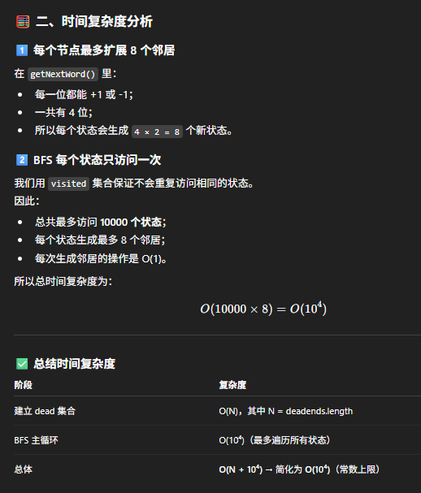
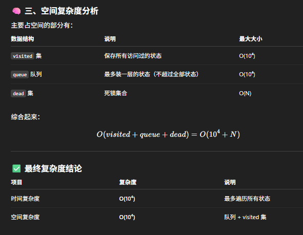

# 752. Open the Lock

##  Problem Summary
You are given a 4-wheel lock that starts at **"0000"**.  
Each wheel can rotate **+1** or **–1** per move (with wrap-around: 0→9, 9→0).  
Some combinations are **deadends** and cannot be used.  
Find the **minimum number of moves** to reach the `target`.

---

##  Why BFS?
- We are looking for the **minimum number of moves** → shortest path.
- Each lock position is one **state**.
- Rotating one wheel is one **edge**.
- BFS (level-order traversal) guarantees we find the shortest path first.

---

## BFS Strategy
- Start from `"0000"` (unless it's a deadend).
- Use:
  - **Queue** → holds states to explore  
  - **Visited Set** → avoids revisiting states  
  - **Deadend Set** → forbidden states  
- For each state, generate 8 neighbors:
  - For each of the 4 wheels → +1 and –1.

---

##  Neighbor Generation Rules
For each wheel:
- Increase digit by 1  
- Decrease digit by 1  

⚠️ Always generate neighbors based on the **original string**, not on an already modified one.

---

##  Conditions to Enqueue a New State
A new lock combination must satisfy:
1. **Not visited**  
2. **Not a deadend**

---

```java
class Solution {
    public int openLock(String[] deadends, String target) {        
        // edge case
        Set<String> dead = new HashSet<>(Arrays.asList(deadends));
        if (dead.contains("0000")) return -1;

        // bfs
        Deque<String> que = new ArrayDeque<>();
        Set<String> visited = new HashSet<>();
        que.offer("0000");
        visited.add("0000");

        int steps = 0;
        while (!que.isEmpty()) {
            int n = que.size();

            for (int i = 0; i < n; i++) {
                String cur = que.poll();
                if (cur.equals(target)) return steps;

                for (String next: getNextWord(cur)) {
                    if (!visited.contains(next) && !dead.contains(next)) {
                        if (next.equals(target)) return steps + 1;
                        que.offer(next);
                        visited.add(next);
                    }
                }
            }
            steps++;
        }

        return -1;
    }

    private List<String> getNextWord(String cur) {
        List<String> res = new ArrayList<>();
        char[] chars = cur.toCharArray();

        for (int i = 0; i < 4; i++) {
            char original = chars[i];
            // + 1
            chars[i] = original == '9' ? '0' : (char)(original + 1);
            res.add(new String(chars));
            
            // -1    
            chars[i] = original == '0' ? '9' : (char)(original - 1);
            res.add(new String(chars));

            chars[i] = original;
        }
        return res;
    }
}
```


