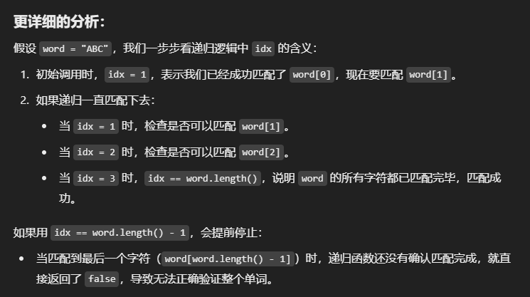

# 79. Word search

## Approach 1 - DFS

- 思路：
    - 先找到一个起点 （board[i][j] == word.charAt(0)
    - 从这个起点开始走四个方向，看看能不能找到下一个字母
        - 没走一个都要mark as visited, 因为不能重复用，如果idx == word.length()那就全部找好了，return true;
        - 如果这条路不对，那么每一个标记visited的都要mark as unvisited, 因为有可能别的路径也要用到
    - 重新找下一条路径的起点，看是否可行

- Unmark the cell as visited after backtracking: If none of the directions lead to a valid solution, we backtrack by unmarking the current cell as visited:
    - This is necessary because the same cell may be part of a valid path for a different starting point or search direction. By unmarking it, we allow future recursive calls to use this cell again if needed.
    - If no valid path is found in any direction, the function returns false. This signals that the current path does not lead to a solution, and the algorithm should backtrack further.
- why dfs is better than bfs for this problem?
    - DFS is recursive, which makes it easier to "remember" the current path as it dives deeper into the grid. This aligns well with the sequential checking of characters in the word.
    - Backtracking in DFS allows you to efficiently explore one potential path, backtrack, and explore the next.
    - BFS explores all possible neighbors simultaneously and requires a queue to keep track of all ongoing paths. You would need to store not only the current cell but also the state of the path (i.e., the index of the word matched so far) in the queue. This increases the space complexity, as the queue can grow quite large, especially for longer words and larger grids.

- 为什么是 if (idx == word.length()) return true; 而不是idx == word.length() -1；


```java
class Solution {
    int n;
    int m;
    int[][] dirs = {{1, 0}, {-1, 0}, {0, -1}, {0, 1}};
    
    public boolean exist(char[][] board, String word) {
        n = board.length;
        m = board[0].length;
        if (m * n < word.length()) return false;

        boolean[][] visited = new boolean[n][m];
        
        for (int i = 0; i < n; i++) {
            for (int j = 0; j < m; j++) {
                if (board[i][j] == word.charAt(0) && findWord(board, word, i, j, 1, visited)) {
                    return true;
                }
            }
        }

        return false;
    }

    private boolean findWord(char[][] board, String word, int row, int col, int idx, boolean[][] visited) {
        if (idx == word.length()) return true;
        visited[row][col] = true;

        for (int[] dir: dirs) {
            int x = row + dir[0];
            int y = col + dir[1];
            if (isVaild(x, y) && !visited[x][y] && board[x][y] == word.charAt(idx)) {
                if (findWord(board, word, x, y, idx+1, visited)) return true;
            }
        }
        visited[row][col] = false; // very important step
        return false; // very important step
    }

    private boolean isVaild(int row, int col) {
        return row >= 0 && row < n && col >= 0 && col < m; 
    }
}
```