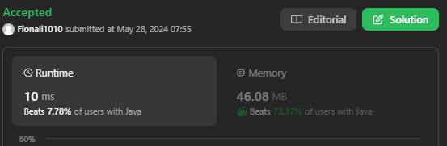
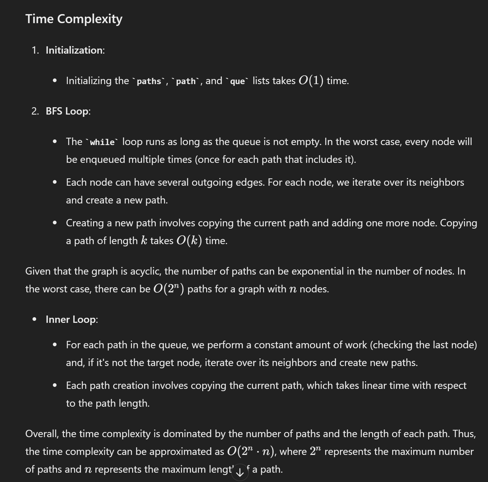
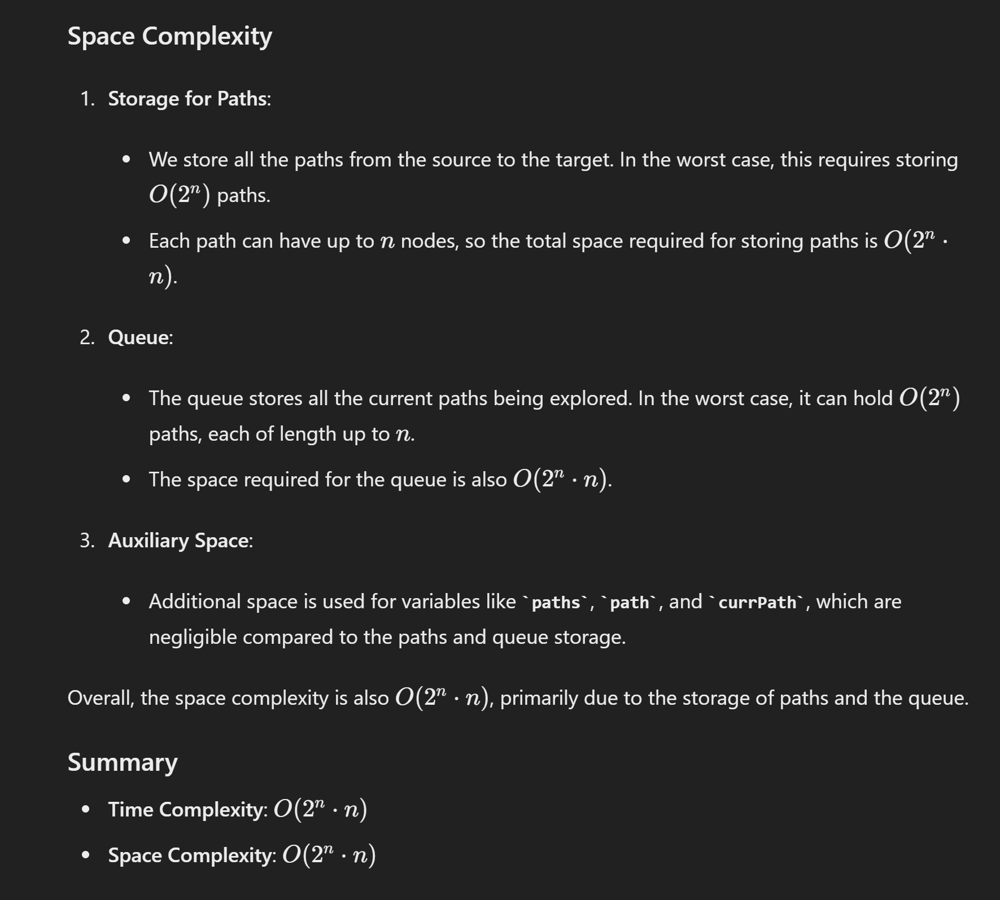

# 797. All Paths From Source to Target

## Approach 1 - BFS using queue(a slow approach)


- do not add visited as we want to revisit some nodes;
- find shortest path need to add visited set;

```java
class Solution {
    public List<List<Integer>> allPathsSourceTarget(int[][] graph) {
        List<List<Integer>> paths = new ArrayList<>(); // answer
       
        Deque<List<Integer>> que = new ArrayDeque<>(); // to store current path
        List<Integer> path = new ArrayList<>();
       
        path.add(0);
        que.add(path);

        while (!que.isEmpty()) {
            List<Integer> currPath = que.poll();
            int lastNode = currPath.get(currPath.size() - 1);
            if (lastNode == graph.length - 1) {
                paths.add(new ArrayList<>(currPath));
                continue;
            } 
            for (int num : graph[lastNode]) {
                List<Integer> newPath = new ArrayList<>(currPath);
                newPath.add(num);
                que.add(newPath);
            }
        }
        return paths;
    }
}

// a very similar one - DFS using stack
class Solution {
    public List<List<Integer>> allPathsSourceTarget(int[][] graph) {
        List<List<Integer>> paths = new ArrayList<>(); // answer
       
        Deque<List<Integer>> stack = new ArrayDeque<>(); // to store current path
        List<Integer> path = new ArrayList<>();
       
        path.add(0);
        stack.push(path);

        while (!stack.isEmpty()) {
            List<Integer> currPath = stack.pop();
            int lastNode = currPath.get(currPath.size() - 1);
            if (lastNode == graph.length - 1) {
                paths.add(new ArrayList<>(currPath));
                continue;
            } 
            for (int num : graph[lastNode]) {
                List<Integer> newPath = new ArrayList<>(currPath);
                newPath.add(num);
                stack.push(newPath);
            }
        }
        return paths;
    }
}
```





## Approach 2 - DFS recursion (a faster approach)


```java
class Solution {
    List<List<Integer>> res = new ArrayList<>();
    
    public List<List<Integer>> allPathsSourceTarget(int[][] graph) {
        List<Integer> path = new ArrayList<>();
        traverse(graph, 0, path);
        return res;    
    }

    public void traverse(int[][] graph, int start, List<Integer> path) {  
        path.add(start);
        
        if (start == graph.length-1) {
            res.add(new ArrayList<>(path));
            path.remove(path.size()-1);
            return;
        }

        for (int v: graph[start]) {
            traverse(graph, v, path);
        }

        path.remove(path.size()-1);
    }
}
```

