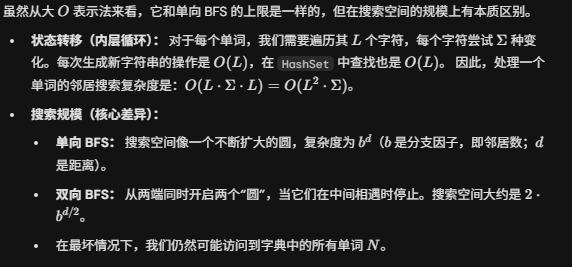
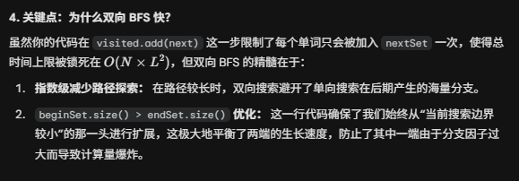

# 127. Word ladder

## Appraoch 1 - 分层 BFS

- 用分层BFS template来找最短距离
- getNextWords 相当于get neighbors
- 判断改变字母匹配的方法也很巧妙，外循环某一个word的每一个char, 内循环26个字母，来改变

```java
class Solution {
    public int ladderLength(String beginWord, String endWord, List<String> wordList) {
        // corner case 
        Set<String> wordSet = new HashSet<>(wordList); // O(N)
        if (!wordSet.contains(endWord)) return 0;

        // initialization
        Deque<String> queue = new ArrayDeque<>();
        Set<String> visited = new HashSet<>();
        queue.offer(beginWord);
        visited.add(beginWord);

        // dfs
        int count = 1;
        while (!queue.isEmpty()) { // O(N)
            int n = queue.size();
           
            for (int i = 0; i < n; i++) {
                String cur = queue.poll();
                char[] chars = cur.toCharArray();
                for (String next: getNextWords(chars, wordSet)) {
                    if (next.equals(endWord)) return count+1;
                    if (visited.add(next)) {
                        queue.offer(next);
                    }
                }
            }
            count++;
        }
        return 0;
    }

    private List<String> getNextWords(char[] chars, Set<String> set) {
        List<String> res = new ArrayList<>();
        
        for (int i = 0; i < chars.length; i++) { // O(L)
            char old = chars[i];
            for (char c = 'a'; c <= 'z'; c++) { // O(26)
                if (c == old) continue;
                chars[i] = c;
                String newStr = new String(chars); // O(L)
                if (set.contains(newStr))res.add(newStr);
            }
            chars[i] = old;
        }
        return res;
    }
}
```
- 不要helper function的版本

```java
class Solution {
    public int ladderLength(String beginWord, String endWord, List<String> wordList) {
        Set<String> dict = new HashSet<>(wordList);
        if (!dict.contains(endWord)) return 0;

        Deque<String> queue = new ArrayDeque<>();
        Set<String> visited = new HashSet<>();

        queue.offer(beginWord);
        visited.add(beginWord);

        int steps = 1; // beginWord itself counts as level 1

        while (!queue.isEmpty()) {
            int size = queue.size();

            for (int i = 0; i < size; i++) {

                String cur = queue.poll();
                char[] chars = cur.toCharArray();

                // ⭐ inline transform — 直接展开，无 helper function，无 List
                for (int j = 0; j < chars.length; j++) {
                    char old = chars[j];

                    for (char c = 'a'; c <= 'z'; c++) {
                        if (c == old) continue;

                        chars[j] = c;
                        String next = new String(chars);

                        if (next.equals(endWord)) return steps + 1;

                        if (dict.contains(next) && visited.add(next)) {
                            queue.offer(next);
                        }
                    }

                    chars[j] = old; // restore
                }
            }

            steps++;
        }

        return 0;
    }
}

```

- time: O(N * 26* L^2);
- Space: O(N * L);


## Appraoch 2 - 双向 BFS

```java
class Solution {
    public int ladderLength(String beginWord, String endWord, List<String> wordList) {
        Set<String> dict = new HashSet<>(wordList);
        if (!dict.contains(endWord)) return 0;

        Set<String> beginSet = new HashSet<>();
        Set<String> endSet = new HashSet<>();
        Set<String> visited = new HashSet<>();

        beginSet.add(beginWord);
        endSet.add(endWord);
        visited.add(beginWord);
        visited.add(endWord);

        int steps = 1;

        while (!beginSet.isEmpty() && !endSet.isEmpty()) {

            // Always expand the smaller set (关键优化)
            if (beginSet.size() > endSet.size()) {
                Set<String> temp = beginSet;
                beginSet = endSet;
                endSet = temp;
            }

            Set<String> next = new HashSet<>();

            for (String word : beginSet) {
                char[] chars = word.toCharArray();

                for (int i = 0; i < chars.length; i++) {
                    char old = chars[i];

                    for (char c = 'a'; c <= 'z'; c++) {
                        if (c == old) continue;
                        chars[i] = c;

                        String newWord = new String(chars);

                        // 两边相遇了！答案就是 steps+1
                        if (endSet.contains(newWord)) return steps + 1;

                        // 尚未访问且在字典中
                        if (dict.contains(newWord) && visited.add(newWord)) {
                            next.add(newWord);
                        }
                    }
                    chars[i] = old;
                }
            }

            // Move forward from the side we expanded
            beginSet = next;
            steps++;
        }
        return 0;
    }
}
```

- time: O(N * 26* L^2);
- Space: O(N * L);





