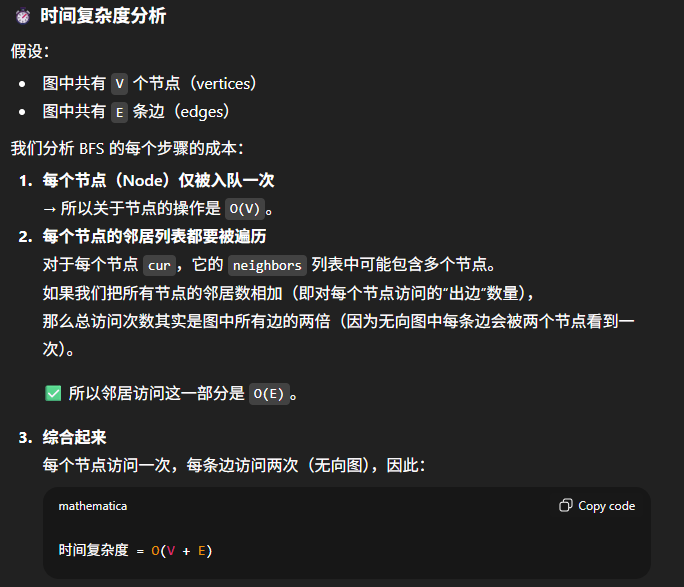
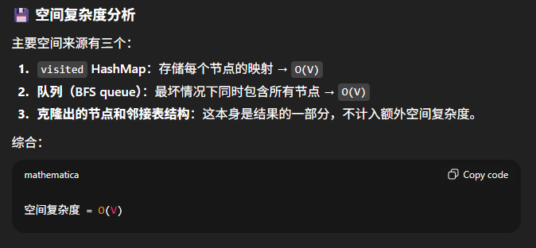

# 133. Clone Graph

## Approach 1 - BFS




```java
class Solution {
    public Node cloneGraph(Node node) {
        if (node == null) return null;

        HashMap<Node, Node> visited = new HashMap<>();
        Deque<Node> que = new ArrayDeque<>();

        que.offer(node);
        visited.put(node, new Node(node.val)); //一旦入队列马上标记

        while (!que.isEmpty()) {
            Node cur = que.poll();

            for (Node neighbor: cur.neighbors) {
                if (!visited.containsKey(neighbor)) {
                    que.offer(neighbor);
                    visited.put(neighbor, new Node(neighbor.val)); //一旦入队列马上标记
                }
                visited.get(cur).neighbors.add(visited.get(neighbor));
            }
        }
        return visited.get(node);
    }
}
```


## Appraoch 2 - helper functions


```java
/*
// Definition for a Node.
class Node {
    public int val;
    public List<Node> neighbors;
    public Node() {
        val = 0;
        neighbors = new ArrayList<Node>();
    }
    public Node(int _val) {
        val = _val;
        neighbors = new ArrayList<Node>();
    }
    public Node(int _val, ArrayList<Node> _neighbors) {
        val = _val;
        neighbors = _neighbors;
    }
}
*/

class Solution {
    public Node cloneGraph(Node node) {
        if (node == null) return node;

        // 3 steps
        List<Node> nodes = findAllNodes(node);
        Map<Node, Node> map = copyNodes(nodes);
        copyEdges(nodes, map);


        return map.get(node);
    }

    private List<Node> findAllNodes(Node node) {
        Set<Node> visited = new HashSet<>();
        Deque<Node> que = new ArrayDeque<>();
        que.offer(node);
        visited.add(node);

        while (!que.isEmpty()) {
            Node cur = que.poll();

            for (Node neighbor: cur.neighbors) {
                if (visited.add(neighbor)) {
                    que.offer(neighbor);
                }
            }
        }

        return new ArrayList<>(visited);
    }

    private Map<Node, Node> copyNodes(List<Node> nodes) {
        HashMap<Node, Node> map = new HashMap<>();

        for (Node node: nodes) {
            map.put(node, new Node(node.val));
        }

        return map;
    }

    private void copyEdges(List<Node> nodes, Map<Node, Node> map) {
        for (Node node: nodes) {
            Node newNode = map.get(node);
            for (Node neighbor: node.neighbors) {
                Node newNeighbor = map.get(neighbor);
                newNode.neighbors.add(newNeighbor);
            }
        }
    }
}
```


