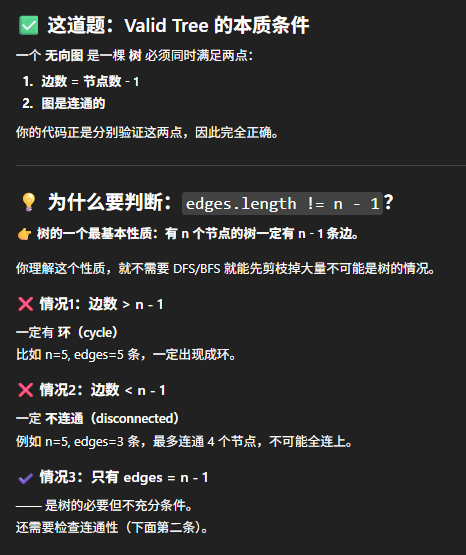
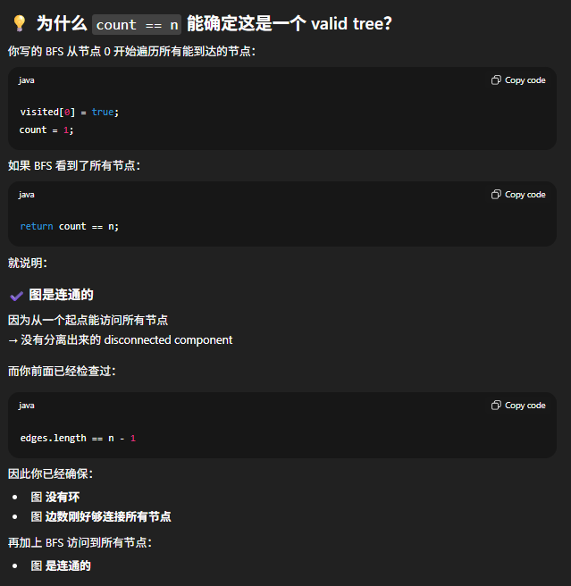

# 261. Graph Valid Tree




## Approach
Equivalently: a graph is a tree if and only if it has exactly n-1 edges and is fully connected.
- Connected → all nodes can be reached.
- Acyclic → no cycles <-> edges.length == n-1

```java
class Solution {
    public boolean validTree(int n, int[][] edges) {
        // 0. check for cycle
        if (edges.length != n-1) return false;
        List<Integer>[] graph = new ArrayList[n];
        
        // 1. build graph
        for (int i = 0; i < n; i++) {
            graph[i] = new ArrayList<>();
        } 

        for (int[] edge: edges) {
            int start = edge[0], end = edge[1];
            graph[start].add(end);
            graph[end].add(start);
        }

        // 2. BFS
        Deque<Integer> que = new ArrayDeque<>();
        boolean[] visited = new boolean[n];
        que.offer(0);
        visited[0] = true;
        int count = 1; //用于判断是否 all connected

        while (!que.isEmpty()) {
            int cur = que.poll();
            for (int neighbor: graph[cur]) {
                if (!visited[neighbor]) {
                    que.offer(neighbor);
                    visited[neighbor] = true;
                    count++;
                };
            }
        }

        return count == n;
    }
}
```
- Time: O(N)
- Space: O(N)
