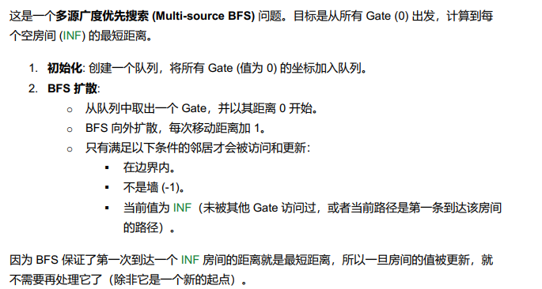

# 286. Walls and gates

## Appraoch 1 - BFS without visited

这是一个多源广度优先搜索 (Multi-source BFS) 问题。目标是从所有 Gate (0) 出发，计算到每
个空房间 (INF) 的最短距离。
- 這裏需要理解的是一旦房間距離被更新過，就不用再此更新了，bfs保證了第一次更新的值一定是距離門最近的值




```java
class Solution {
    private static final int INF = 2147483647;

    public void wallsAndGates(int[][] rooms) {
        if (rooms == null || rooms.length == 0 || rooms[0].length == 0) return;

        int rows = rooms.length;
        int cols = rooms[0].length;

        Queue<int[]> queue = new LinkedList<>();

        // 1. 找到所有 gate(0)，作为 BFS 起点放入队列
        for (int r = 0; r < rows; r++) {
            for (int c = 0; c < cols; c++) {
                if (rooms[r][c] == 0) {
                    queue.offer(new int[]{r, c});
                }
            }
        }

        // BFS 的四个方向
        int[][] dirs = new int[][]{{1,0}, {-1,0}, {0,1}, {0,-1}};

        // 2. 多源 BFS 扩散
        while (!queue.isEmpty()) {
            int[] cur = queue.poll();
            int row = cur[0];
            int col = cur[1];
            int distance = rooms[row][col];

            for (int[] d : dirs) {
                int newRow = row + d[0];
                int newCol = col + d[1];

                // 边界检查 + 不是墙(-1)
                if (newRow < 0 || newRow >= rows || newCol < 0 || newCol >= cols) continue;
                if (rooms[newRow][newCol] == -1) continue;

                // 只有当是 INF（未访问过）时才更新
                if (rooms[newRow][newCol] == INF) {
                    rooms[newRow][newCol] = distance + 1;
                    queue.offer(new int[]{newRow, newCol});
                }
            }
        }
    }
}

```
- Time Complexity: O(m × n)
- Space Complexity: O(m × n)


