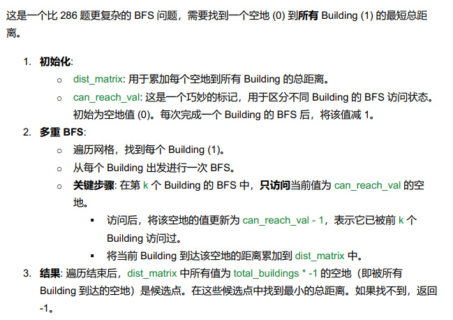

# 317. Shortest Distance from All Buildings

## Approach 1
> **核心思想：从每个 building 出发做 BFS，统计所有空地能否到达全部建筑并计算最小距离和。**  
> **这道题看起来很复杂，但其实是一个非常典型且清晰的 BFS 题。**

- 我们要从 *所有 empty land* 中，找到这样一个格子：
    - 它能到达 **所有 building**
    - 它到所有 building 的 **距离之和最短**
如果没有任何 empty land 能到达所有 building → 返回 `-1`。

## **第一步：统计 building 数量**
我们需要知道：  
> “一个空地是否到达了所有建筑？”

因此必须先遍历整个 grid，计算 building 的总数量 `totalBuildings`。

---

## **第二步：对每一个 building 做 BFS（关键步骤）**

> **为什么从 building 出发？**  
> 因为空地很多，building 通常更少，从 building 出发 BFS 更高效。

对于每个 building：
- 做一次 **标准 BFS（level-order traversal）**
- 在 BFS 中更新两个矩阵：

| 矩阵 | 含义 |
|------|--------|
| `distance[r][c]` | 当前空地到所有 building 的距离之和 |
| `reach[r][c]` | 当前空地能到达的 building 数量 |

### ✔ BFS 过程的要点：
- 使用 `visited[][]` 避免重复走
- 只能走到 **空地**（grid 值为 0）
- 不能走建筑（1）和障碍物（2）
- 每层 BFS 距离 `dist++`
- 每访问到一个空地（0）：
  - `distance[newRow][newCol] += dist`
  - `reach[newRow][newCol]++`

这其实就是：

> **多源 BFS 的叠加统计过程，只是每次 BFS 是从一个 building 单独开始。**

---

## **第三步：扫描所有空地找答案**
最后遍历所有 grid：

对每个 cell (i,j)：

- 如果是空地 `grid[i][j] == 0`
- 且能到达所有 building：`reach[i][j] == totalBuildings`
- 更新答案：  
  `result = min(result, distance[i][j])`

如果 result 仍然是 `Integer.MAX_VALUE` → 返回 `-1`


```java
class Solution {
    public int shortestDistance(int[][] grid) {
        int m = grid.length, n = grid[0].length;

        int[][] distSum = new int[m][n];
        int[][] reach = new int[m][n];

        int totalBuildings = 0;

        // 统计 building 数量, 对每个 building 做 BFS
        for (int i = 0; i < m; i++) {
            for (int j = 0; j < n; j++) {
                if (grid[i][j] == 1) {
                    totalBuildings++;
                    bfs(i, j, grid, distSum, reach);
                }
            }
        }

        int result = Integer.MAX_VALUE;

        // 找空地中 reach = totalBuildings 的点
        for (int i = 0; i < m; i++) {
            for (int j = 0; j < n; j++) {
                if (grid[i][j] == 0 && reach[i][j] == totalBuildings) {
                    result = Math.min(result, distSum[i][j]);
                }
            }
        }

        return result == Integer.MAX_VALUE ? -1 : result;
    }

    private void bfs(int sr, int sc, int[][] grid, int[][] distSum, int[][] reach) {
        int m = grid.length, n = grid[0].length;
        boolean[][] visited = new boolean[m][n];
        int[][] dirs = {{1,0}, {-1,0}, {0,1}, {0,-1}};

        Deque<int[]> queue = new ArrayDeque<>();
        queue.offer(new int[]{sr, sc});
        visited[sr][sc] = true;

        int dist = 0;

        while (!queue.isEmpty()) {
            int size = queue.size();
            dist++;

            for (int k = 0; k < size; k++) {
                int[] cur = queue.poll();
                int r = cur[0], c = cur[1];

                for (int[] d : dirs) {
                    int nr = r + d[0], nc = c + d[1];

                    if (nr >= 0 && nr < m && nc >= 0 && nc < n 
                        && !visited[nr][nc] && grid[nr][nc] == 0) {

                        visited[nr][nc] = true;
                        distSum[nr][nc] += dist;
                        reach[nr][nc]++;
                        queue.offer(new int[]{nr, nc});
                    }
                }
            }
        }
    }
}
```

- time: O(m^2 * n^2);
- space: O(m * n);

## Approach 2: 空间更优化的解法（推荐）



```java
class Solution {

    private static final int[][] DIRS = {{1,0}, {-1,0}, {0,1}, {0,-1}};

    public int shortestDistance(int[][] grid) {
        int rows = grid.length;
        int cols = grid[0].length;

        int[][] distMatrix = new int[rows][cols];
        int canReachVal = 0;
        int minTotalDist = Integer.MAX_VALUE;

        // 遍历所有 building，逐个 BFS
        for (int r = 0; r < rows; r++) {
            for (int c = 0; c < cols; c++) {
                if (grid[r][c] == 1) {

                    minTotalDist = bfsFromBuilding(r, c, grid, distMatrix, canReachVal);

                    // 若本次 BFS 没找到任何 reachable 空地，说明无解
                    if (minTotalDist == Integer.MAX_VALUE) return -1;

                    // 下一次 BFS，只能访问 grid == canReachVal - 1 的空地
                    canReachVal--;
                }
            }
        }

        return minTotalDist == Integer.MAX_VALUE ? -1 : minTotalDist;
    }

    /** 
     * 从某一栋 building 对 grid 做一次 BFS。
     * 返回：本 building 后更新的 distMatrix 里最小的 reachable 距离。
     */
    private int bfsFromBuilding(int sr, int sc, int[][] grid, int[][] distMatrix, int canReachVal) {
        int rows = grid.length;
        int cols = grid[0].length;

        Queue<int[]> queue = new ArrayDeque<>();
        queue.offer(new int[]{sr, sc, 0}); // r, c, dist

        int localMin = Integer.MAX_VALUE;

        while (!queue.isEmpty()) {
            int[] cur = queue.poll();
            int r = cur[0], c = cur[1], dist = cur[2];
            int newDist = dist + 1;

            for (int[] d : DIRS) {
                int nr = r + d[0];
                int nc = c + d[1];

                if (nr >= 0 && nr < rows && nc >= 0 && nc < cols
                        && grid[nr][nc] == canReachVal) {

                    distMatrix[nr][nc] += newDist;
                    grid[nr][nc]--;  // 标记已被本 building 访问
                    queue.offer(new int[]{nr, nc, newDist});

                    localMin = Math.min(localMin, distMatrix[nr][nc]);
                }
            }
        }

        return localMin;
    }
}
```