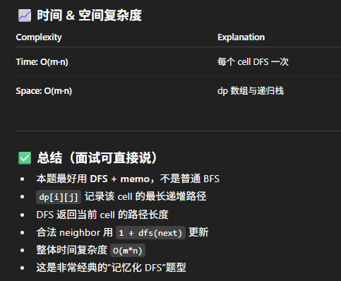

# 329. Longest Increasing Path in a Matrix

## Approach 1: DFS + memorization

## 核心解法：DFS + Memoization（推荐）

> 为什么不用 BFS？  
> - 普通 BFS 求的是最短路径，不适合 longest path  
> - 用拓扑排序 BFS 虽然可行，但写法复杂  
> - DFS + memo 才是本题最清晰、最主流、最好写的做法

## 解法整体思路

### 1. 建立 `dp[m][n]`
`dp[i][j]` 表示从 cell `(i, j)` 出发能走到的 **最长递增路径长度**。

- 如果某个 cell 的结果已经算过 → 直接返回 dp 值  
- 每个 cell 最多计算一次 → 总体时间 `O(m*n)`


### 2. 外层遍历所有 cells
双重 for-loop：

- 对每个 cell 调用 DFS  
- 统计全局最大路径 `maxLen`

最终返回 `maxLen`。


### 3. DFS 的职责（两件事）

### （1）计算并返回当前 cell 的最长路径长度  
流程：

1. 如果 dp 已经有值 → 直接 return  
2. 用 `best = 1` 作为初始值（至少包含自己）  
3. 往四个方向扩散  
4. 对每个合法并且值更大的邻居执行：  
5. 得出当前 cell 的最长路径

### （2）把结果写进 dp 再 return  
例如 DFS 求出 `(r, c)` 最长路径 = 6，这样下次直接用，不重复 DFS。

### 为什么是 `1 + dfs(next)`？

因为：

- 当前 cell 的贡献是 `1`
- 其余路径由 neighbor 的 dfs 返回值决定

例如 dfs(next) = 5 → 当前 cell = `1 + 5 = 6`

```java
class Solution {
    private int[][] matrix;
    private int rows, cols;
    private int[][] dp;   // memoization
    private int[][] dirs = {{1,0}, {-1,0}, {0,1}, {0,-1}};
    
    public int longestIncreasingPath(int[][] matrix) {
        if (matrix == null || matrix.length == 0) return 0;

        this.matrix = matrix;
        rows = matrix.length;
        cols = matrix[0].length;
        dp = new int[rows][cols];

        int maxLen = 0;
        for (int i = 0; i < rows; i++) {
            for (int j = 0; j < cols; j++) {
                maxLen = Math.max(maxLen, dfs(i, j));
            }
        }
        return maxLen;
    }

    private int dfs(int r, int c) {
        if (dp[r][c] != 0) return dp[r][c];  // already computed

        int best = 1;  // at least the cell itself

        for (int[] d : dirs) {
            int nr = r + d[0];
            int nc = c + d[1];

            if (nr >= 0 && nr < rows && nc >= 0 && nc < cols 
                && matrix[nr][nc] > matrix[r][c]) {
                best = Math.max(best, 1 + dfs(nr, nc));
            }
        }

        dp[r][c] = best;
        return best;
    }
}
```

