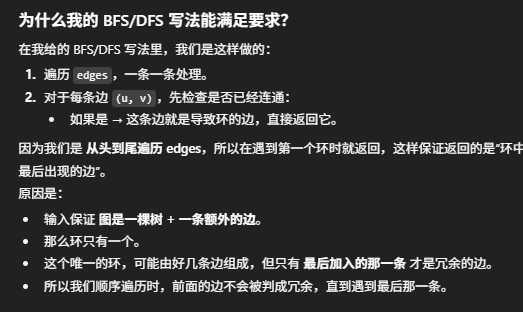

# 684. Redundant Connection

In this problem, a tree is an undirected graph that is connected and has no cycles. - 这个定义很重要

## Approach: BFS
- 最优解为union find (O(N))，这里我们先用BFS
    - Time: O(N^2)
    - Space:  O(N^2)
- 思路：
    - 我们一开始没有任何边，图是空的。
    - 遍历输入 edges 数组，把每条边依次“尝试加入图”。
    - 于每一条边 (u, v)：
    - 在当前图里做一次 BFS，检查从 u 出发能不能到达 v。
    - 如果能到达，说明 u 和 v 已经连通，再加 (u, v) 会形成一个环，所以这就是 冗余边，直接返回它。
    - 如果不能到达，就把 (u, v) 正式加入图里（双向加入邻接表）。
    - 这样，保证返回的就是环中 最后出现的那条边，符合题目要求。



```java
class Solution {
    public int[] findRedundantConnection(int[][] edges) {
        int n  = edges.length;
        List<Integer>[] graph = new ArrayList[n+1];

        for (int i = 0; i < n+1; i++) {
            graph[i] = new ArrayList<>();
        }

        for (int[] e: edges) {
            int u = e[0], v= e[1];
            if (isConnected(u, v, graph, n)) return e;
            graph[u].add(v);
            graph[v].add(u);
        }

        return new int[0];
    }

    private boolean isConnected(int start, int target, List<Integer>[] graph, int n) {
        Deque<Integer> que = new ArrayDeque<>();
        boolean[] visited = new boolean[n+1];
        que.offer(start);
        visited[start] = true;

        while (!que.isEmpty()) {
            int cur = que.poll();
            for (int node: graph[cur]) {
                if (node == target) return true;
                if (!visited[node]) {
                    que.offer(node);
                    visited[node] = true;
                }
            }
        }
        return false;
    }
}
```