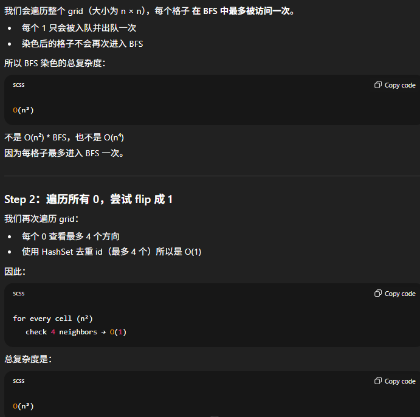
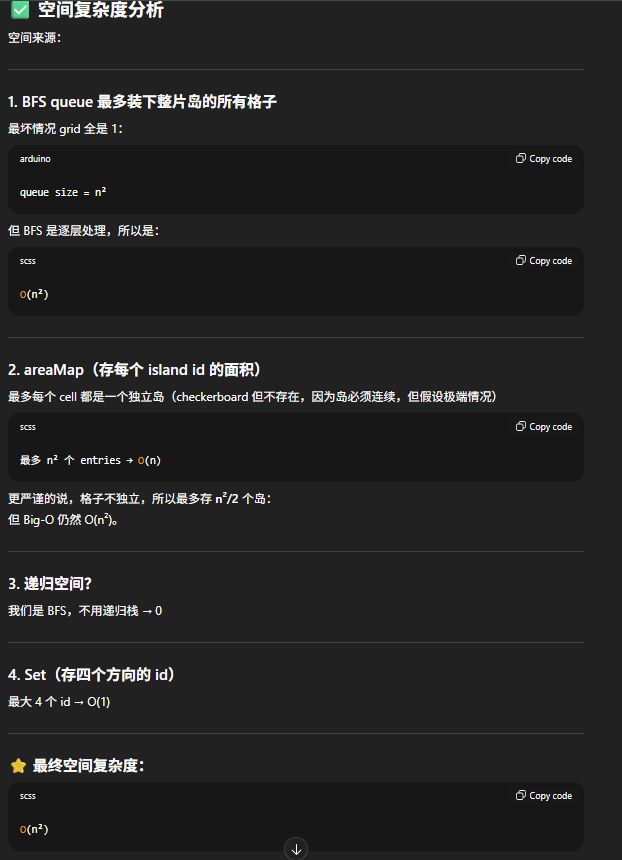

# 827. Making A Large Island

## Approach BFS
你有一个 0/1 grid，可以将 最多一个 0 改成 1，问最大连通岛屿面积是多少。

Step 1：给每个岛屿涂色（编号）+ 计算面积

    - 我们用 DFS/BFS 将每个岛屿标记成一个编号（从 2 开始，因为 0 和 1 已经用了）
    - 同时计算每一个编号对应的面积
    - 存在 Map<Integer, Integer> idToArea

Step 2：遍历每个 0，假设把它变成 1

    - 把一个 0 变成 1 时，它会连接最多 4 个方向的不同岛屿
    - 为了避免重复计算同一个 island（因为可能两个方向邻的都是同一个岛），要用 Set 去重。

Step 3：全局记录最大值

    - 如果 grid 全是 1，那答案就是整张表面积

```java
class Solution {
    int rows;
    int cols;
    int[][] dirs = {{0, 1}, {0, -1}, {1, 0}, {-1, 0}};
    
    public int largestIsland(int[][] grid) {
        rows = grid.length;
        cols = grid[0].length;
        int mark = 2; // island ids start from 2
        int maxArea = 0;
        Map<Integer, Integer> map = new HashMap<>();

        // Step 1: BFS to color all islands and calculate area
        for (int i = 0; i < rows; i++) {
            for (int j = 0; j < cols; j++) {
                if (grid[i][j] == 1) {
                    int area = bfs(i, j, grid, mark);
                    map.put(mark, area);
                    maxArea = Math.max(maxArea, area); // we need to track the biggest island in case there is no zeros
                    mark++;
                }
            }
        }

        // Step 2: Try to flip every 0 and calculate possible max area
        for (int i = 0; i < rows; i++) {
            for (int j = 0; j < cols; j++) {
                if (grid[i][j] == 0) {
                    Set<Integer> ids = new HashSet<>();
                    int area = 1;

                    for (int[] dir: dirs) {
                        int newRow = dir[0] + i;
                        int newCol = dir[1] + j;

                        if (isValid(newRow, newCol) && grid[newRow][newCol] > 1) {
                            ids.add(grid[newRow][newCol]);
                        }
                    }

                    for (int num: ids) {
                        area += map.get(num);
                    }
                    
                    maxArea = Math.max(area, maxArea);
                }
            }
        }

        return maxArea;
    }

    private int bfs(int row, int col, int[][] grid, int mark) {
        Deque<int[]> que = new ArrayDeque<>();
        que.offer(new int[]{row, col});
        grid[row][col] = mark;
        int count = 0;

        while (!que.isEmpty()) {
            int[] curr = que.poll();
            count++;

            for (int[] dir: dirs) {
                int newRow = dir[0] + curr[0];
                int newCol = dir[1] + curr[1];

                if (isValid(newRow, newCol) && grid[newRow][newCol] == 1) {
                    que.offer(new int[]{newRow, newCol});
                    grid[newRow][newCol] = mark;
                }
            }
        }

        return count;
    }

    private boolean isValid(int row, int col) {
        return row >= 0 && row < rows && col >= 0 && col < cols;
    }
}

```


