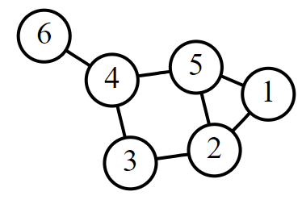

# Graph

## BFS
### Traverse each node



```java
// graph defined as follow:
HashMap<Integer, List<Integer>> graph = new HashMap<>();

        graph.put(1, Arrays.asList(2,5));
        graph.put(2, Arrays.asList(1,3,5));
        graph.put(3, Arrays.asList(2,4));
        graph.put(4, Arrays.asList(3,5,6));
        graph.put(5, Arrays.asList(1,2,4));
        graph.put(6, Arrays.asList(4));

// BFS
  public static void graphBFS(int start, HashMap<Integer, List<Integer>> graph) {
        Set<Integer> set = new HashSet<>();
        Deque<Integer> que = new ArrayDeque<>();
        que.offer(start);
        set.add(start);

        while (!que.isEmpty()) {
            int curr = que.poll();
            System.out.println(curr);
            set.add(curr);
            for (int num: graph.get(curr)) {
                if (set.add(num)) {
                    que.offer(num);
                }
            }

        }

    }

```

### search for shortest path

```java

HashMap<Integer, List<Integer>> graph = new HashMap<>();
graph.put(1, Arrays.asList(2,5));
graph.put(2, Arrays.asList(1,3,5));
graph.put(3, Arrays.asList(2,4));
graph.put(4, Arrays.asList(3,5,6));
graph.put(5, Arrays.asList(1,2,4));
graph.put(6, Arrays.asList(4));

public static List<Integer> findShortestPath(int start, int end, HashMap<Integer, List<Integer>> graph) {
        Deque<List<Integer>> que = new ArrayDeque<>();
        Set<Integer> visited = new HashSet<>();
        List<Integer> path = new ArrayList<>();
        path.add(start);
        que.add(path);
        visited.add(start);

        while (!que.isEmpty()) {
            List<Integer> currPath = que.poll();
            int lastNode = currPath.get(currPath.size() - 1);

            // Check if we have reached the end node
            if (lastNode == end) {
                return currPath;
            }

            // Explore neighbors
            for (int neighbor : graph.getOrDefault(lastNode, new ArrayList<>())) {
                if (visited.add(neighbor)) {  // If neighbor is not visited
                    List<Integer> newPath = new ArrayList<>(currPath);
                    newPath.add(neighbor);
                    que.add(newPath);
                }
            }
        }
```

## DFS
### Traverse each node

```java
public static void graphDFS(int start, HashMap<Integer, List<Integer>> graph) {
        Deque<Integer> stack = new ArrayDeque<>();
        Set<Integer> visited = new HashSet<>();

        stack.push(start);
        visited.add(start);

        while (!stack.isEmpty()) {
            int curr = stack.pop();
            System.out.println(curr);

            for (int num: graph.get(curr)) {
                if (visited.add(num)) {
                    stack.push(num);
                }
            }
        }

    }
```