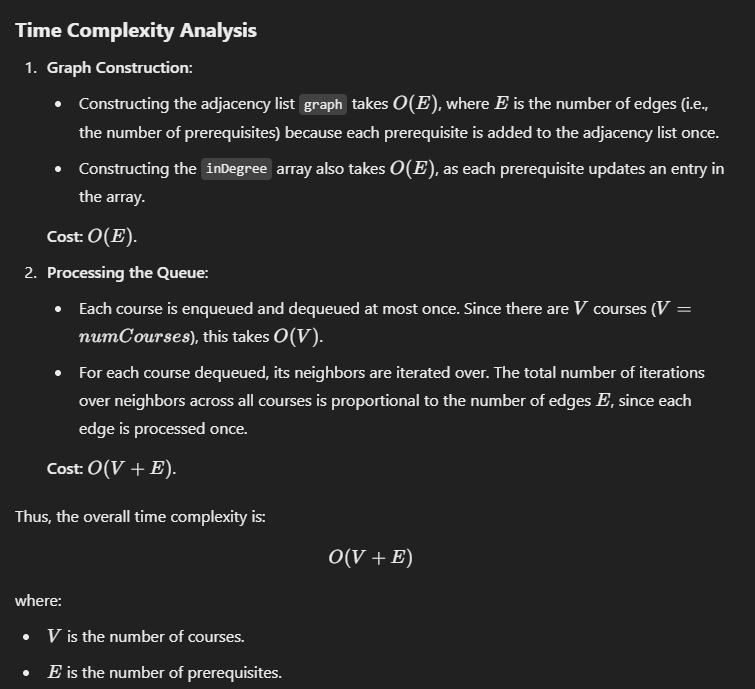
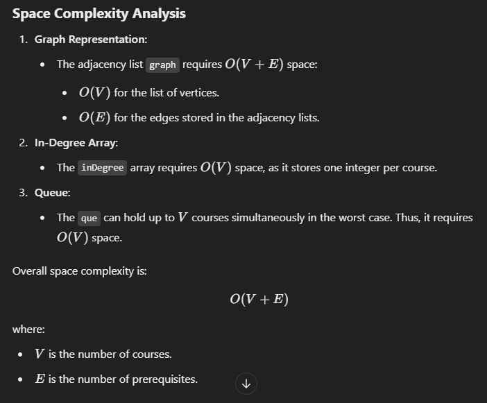

# 207. Course Schedule

- 问是否存在拓扑排序

```java
class Solution {
    public boolean canFinish(int numCourses, int[][] prerequisites) {
        // construct graph and inDegree
        List<Integer>[] graph = new List[numCourses];
        int[] inDegree = new int[numCourses];

        for (int i = 0; i < numCourses; i++) {
            graph[i] = new ArrayList<>();
        }

        for (int[] course: prerequisites) {
            graph[course[1]].add(course[0]);
            inDegree[course[0]]++;
        }

        // add course with indegree of zero to que
        Deque<Integer> que = new ArrayDeque<>();
        for (int i = 0; i < numCourses; i++) {
            if (inDegree[i] == 0) que.offer(i);
        }

        // que
        int selectedCourses = 0;
        while (!que.isEmpty()) {
            int cur = que.poll();
            selectedCourses++;
            for (int course: graph[cur]) {
                inDegree[course]--;
                if (inDegree[course] == 0) que.add(course);
            }
        }
        return selectedCourses == numCourses;
    }
}
```


