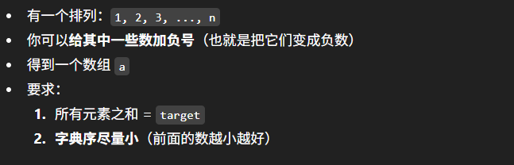

# 3752. Lexicographically Smallest Negated Permutation that Sums to Target



## Approach 1 - Greedy + Math

[参考灵神解答](https://leetcode.cn/problems/lexicographically-smallest-negated-permutation-that-sums-to-target/solutions/3839568/tan-xin-on-zuo-fa-pythonjavacgo-by-endle-7ojw/)

1. 确定corner cases, 一定不可能找到适合的组合 (主要是数学推理，参考灵神的解答): 
    - Math.abs(target) > mx
    - (mx - target) % 2 != 0 
    - retunr empty array
2. Greedy
    - 要让字典序最小，第一个数越小越好。所以负数要填在前面，所以本题是负数主导的
    - 大的负数排在前面，大的正数排在后面

```java
class Solution {
    public int[] lexSmallestNegatedPerm(int n, long target) {
        long maxSum = (long) n * (n + 1) / 2;
        if (Math.abs(target) > maxSum || (maxSum - target) % 2 != 0) {
            return new int[]{};
        }
        long negSum = (maxSum - target) / 2; // 计算出所有需要变成负数的数之和

        int[] ans = new int[n];
        int l = 0;
        int r = n - 1;
        // 从 1,2,...,n 中选一些数，元素和等于 negSum
        // 为了让负数部分的字典序尽量小，从大往小选
        for (int x = n; x > 0; x--) {
            if (negSum >= x) {
                negSum -= x; 
                ans[l++] = -x;
            } else {
                // 大的正数填在末尾
                ans[r--] = x;
            }
        }
        return ans;
    }
}
```

- 时间复杂度：O(n)。
- 空间复杂度：O(1)。返回值不计入。