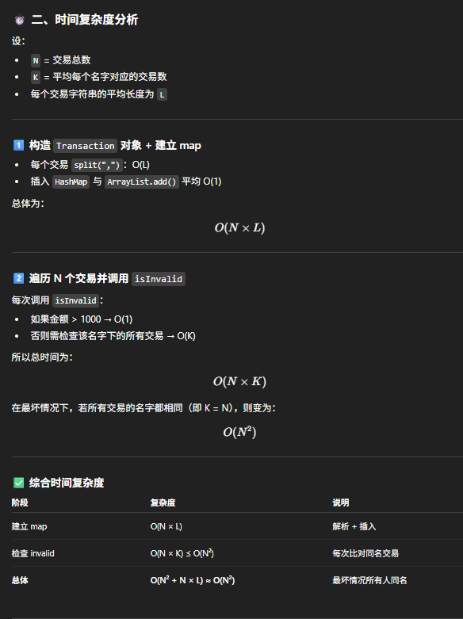
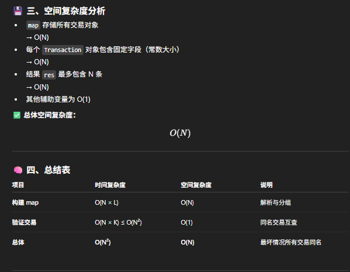

# 1169. Invalid Transactions

- time: O(N^2);
- space: O(N)

## 🧩 核心思路

这道题的逻辑其实比较 **straightforward（直接）**。  
主要思路如下：

1. **构建一个 Map**
   - `key`: transaction 的 **name**
   - `value`: 该 name 对应的所有 transactions（同名交易的 list）

2. **为了操作方便**，把每个 transaction 从字符串转成一个类对象。  
   定义一个 `Transaction` 类，包含以下属性：
   - `name`
   - `time`
   - `amount`
   - `city`


## 🏗️ 步骤详解

### Step 1️⃣ 构建映射表

- 遍历输入的所有 transaction 字符串；
- 把它们 parse 成 `Transaction` 对象；
- 根据 `name` 把对象加入到 `Map<String, List<Transaction>>` 里。

👉 **目的**：  
快速找到所有 **同一个人** 的交易记录，用于后续比对。

---

### Step 2️⃣ 判断每笔交易是否合法

遍历所有 transactions：

- 对于每个 `transaction t`：
  1. **条件一**：如果 `t.amount > 1000` → **不合法**
  2. **条件二**：  
     - 找出同名交易的列表 `list = map.get(t.name)`
     - 遍历这个 `list` 中的其他交易 `t2`  
       若满足：
       - `t.city != t2.city`
       - `|t.time - t2.time| <= 60`
       → 则这笔交易也 **不合法**

- 所有不合法的交易加入结果 `invalidTransactions` 中。


## 🔍 Step 3️⃣ 返回结果

最终返回所有 invalid transactions 的字符串形式即可。


## 💡 关键点总结

- 使用 `Transaction` 类代替字符串方便处理属性；
- Map 的 key 是 name，可以快速定位到相同 name 的交易；
- “不合法”交易的判断逻辑包括两种情况：
  - **金额超限**：`amount > 1000`
  - **时间 + 城市冲突**：同名交易中，不同城市且时间差 ≤ 60 分钟。

```java
class Solution {
    class Transaction {
        String name;
        String city;
        int time;
        int amount;

        Transaction(String s) {
            String[] arr = s.split(",");
            name = arr[0];
            time = Integer.parseInt(arr[1]);
            amount = Integer.parseInt(arr[2]);
            city = arr[3];
        }
    }

    public List<String> invalidTransactions(String[] transactions) {
        List<String> res = new ArrayList<>();
        Map<String, List<Transaction>> map = new HashMap<>();

        for (String s: transactions) {
            Transaction t = new Transaction(s);
            map.putIfAbsent(t.name, new ArrayList<>());
            map.get(t.name).add(t);
        }

        for (String s: transactions) {
            Transaction t = new Transaction(s);
            if (!isValid(t, map.getOrDefault(t.name, new ArrayList<>()))) res.add(s);
        }

        return res;
    }

    private boolean isValid(Transaction t, List<Transaction> list) {
        if (t.amount > 1000) return false;

        for (Transaction transaction: list) {
            if (!t.city.equals(transaction.city) && Math.abs(t.time-transaction.time) <= 60) {
                return false;
            }
        }

        return true;
    }
}

```


