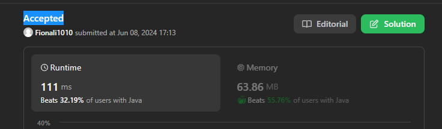

# 128. Longest Consecutive Sequence

## Approach 1 - set O(N) (推荐 这道题要求O(N)时间)

- 首先用set去除duplicates
- loop through set, 找到possible consecutive sequence 的start

```java
class Solution {
    public int longestConsecutive(int[] nums) {
        Set<Integer> set = new HashSet<>();
        for (int num: nums) {
            set.add(num);
        }

        int max = 0;

        for (int num: set) { // must loop through set as nums has duplicates 
            if (set.contains(num-1)) continue; // // only start counting from the beginning of a sequence
            
            int cur = num;
            int count = 1;
            while (set.contains(cur+1)) { // Every number is visited at most once in this while loop across the entire execution.
                cur += 1;
                count++;
            }
            max = Math.max(max, count); // 一定要在while loop外面比较
        }
        return max;
    }
}

```
- time: O(N)

## Approach 2 - set

```java
class Solution {
    public int longestConsecutive(int[] nums) {
        if (nums.length == 0) return 0;
        Arrays.sort(nums);
        
        int count = 1; // nums loop starts with index 1, so count starts with 1 count
        int max = 1;

        for (int i = 1; i < nums.length; i++) {
            if (nums[i] == nums[i-1]) continue;
            if (nums[i] == nums[i-1]+1) {
                count++;
                max = Math.max(max, count);
            } else {
                count = 1;
            }
        }

        return max;
    }
}
```
- time: O(NlogN) due to sort


## Approach 3 - set + heap



```java
class Solution {
    public int longestConsecutive(int[] nums) {
        if (nums.length == 0) return 0;

        Set<Integer> set = new HashSet<>();
        PriorityQueue<Integer> heap = new PriorityQueue<>();

        for (int num: nums) {
            if (set.add(num)) {
                heap.add(num);
            }
        }

        int res = 0;
        int count = 0;
        int pre = Integer.MAX_VALUE;
       
        while (!heap.isEmpty()) {
            int n = heap.poll();
            if (n - pre == 1) {
                count++;
                res = Math.max(res, count);
            } else {
                count = 0;
            }
            pre = n;
        }   

        return res+1;     
    }
}

// a similar but faster approach
class Solution {
    public int longestConsecutive(int[] arr) {
        int n = arr.length;
        if(n == 0 || n == 1) {
            return n;
        }

        HashSet<Integer> set = new HashSet<>();
        PriorityQueue<Integer> pq = new PriorityQueue<>();

        for (int num: nums) {
            if (set.isEmpty() || !set.contains(num)) { // skip duplicates
                pq.offer(num);
                set.add(num);
            }
        }

        int len = 0;
        int maxlen = 0;
        int prev = pq.peek()-1; // // we made up this prev so len starts from 0;

        while(!pq.isEmpty()) {
            int curr = pq.remove();

            if(curr == prev+1) {
                len++;
                maxlen = Math.max(maxlen,len);
            } else {
                len = 1;
            }
            prev = curr;
        }

        return maxlen;
    }
}
```

- time: O(NlogN) due to sort
    - Each offer() operation in a Java PriorityQueue is O(log N) (heap insertion).
    - Each poll() is also O(log N) (heapify-down after removal).

