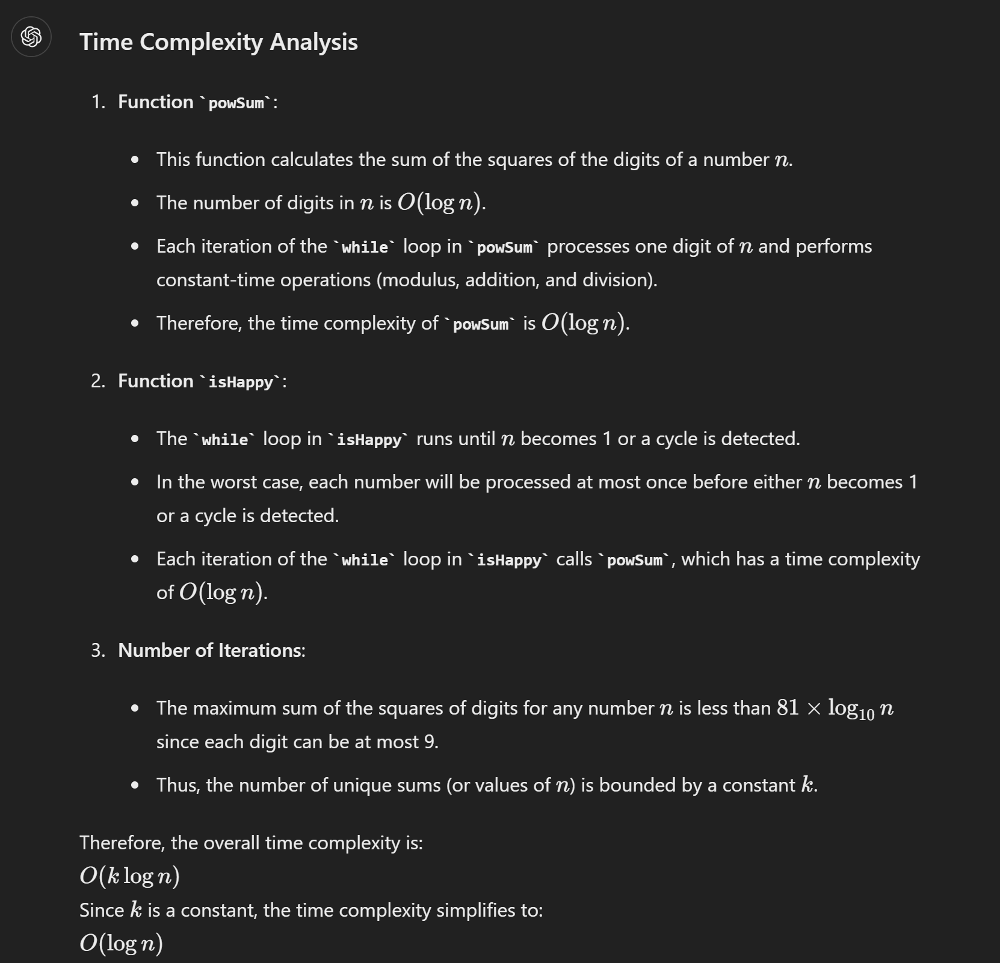
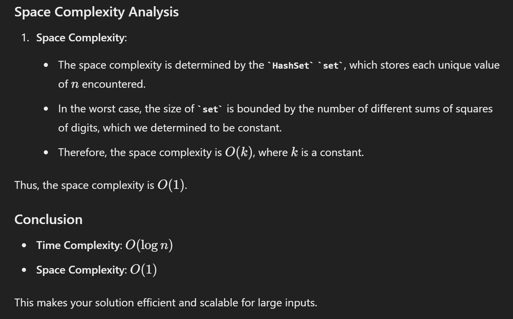

# 202. Happy Number

```java
class Solution {
    public boolean isHappy(int n) {
        HashSet<Integer> seen = new HashSet<>();
        while ( n != 1 && !seen.contains(n)) { // key!!!!
            seen.add(n);
            n = powSum(n);
        }
        return n ==1;
    }

    public int powSum(int n) {
        int r = 0;
        int sum = 0;
        
        while (n != 0) {
            r = n % 10;
            sum += r * r;
            n = n /10;
        }
        return sum;
    }
}
```





