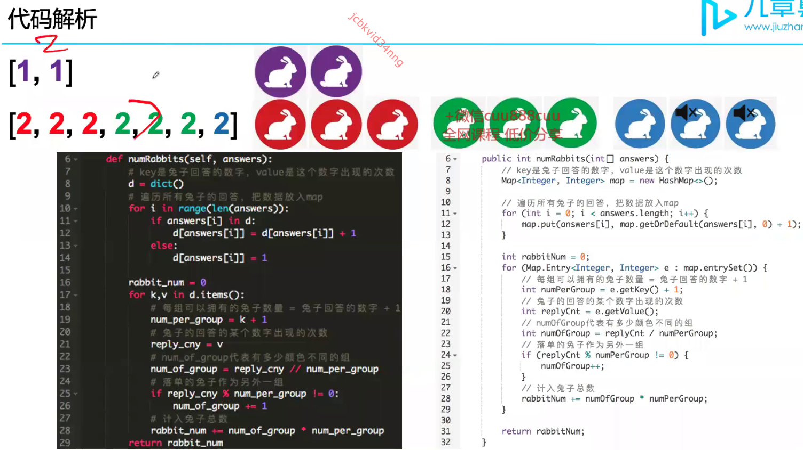

# 2215. Find the Difference of Two Arrays

[Leetcode 2215 (Easy)][2215]

[2215]: https://leetcode.com/problems/find-the-difference-of-two-arrays/description/?envType=study-plan-v2&envId=leetcode-75

## Approach 1


```java
class Solution {
      public List<List<Integer>> findDifference(int[] nums1, int[] nums2) {
        List<List<Integer>> res = new ArrayList<>(2);
        res.add(new ArrayList<>()); // 必须declare连个空list, 不然res.get[0], res.get[1] 会报错
        res.add(new ArrayList<>());
        
        //用set去重
        Set<Integer> set1 = new HashSet<>();
        Set<Integer> set2 = new HashSet<>();

        for (int num: nums1) {
            set1.add(num);
        }

        for (int num: nums2) {
            set2.add(num);
        }

        //比较是否有重复
        for (int num: nums2) {
            if (set1.contains(num)) {
                set1.remove(num);
                set2.remove(num);
            }
        }

        //把没有重复的放进res，addAll只能用于两个collections之间
        res.get(0).addAll(set1);
        res.get(1).addAll(set2);

        return res;
    }
}
```