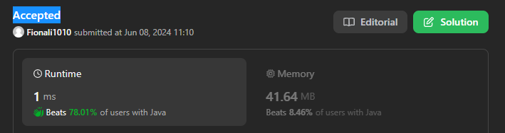

# 290. Word Pattern 

```java
class Solution {
    public boolean wordPattern(String pattern, String s) {
        String[] str = s.split(" ");

        if (str.length != pattern.length()) {
            return false;
        }

        HashMap<Character, String> map = new HashMap<>();
        Set<String> seen = new HashSet<>();

        for (int i = 0; i < str.length; i++) {
            char c = pattern.charAt(i);
            String word = str[i];

            if (!map.containsKey(c)) {
                if (seen.contains(word)) {
                    return false;
                }

                map.put(c, word);
                seen.add(word);
            } else {
                if (!map.get(c).equals(word)) { // would be wrong if we use == to compare
                    return false;
                }
            }
        }
        return true;
    }
}
```

- time: O(n);
- Space: O(n);