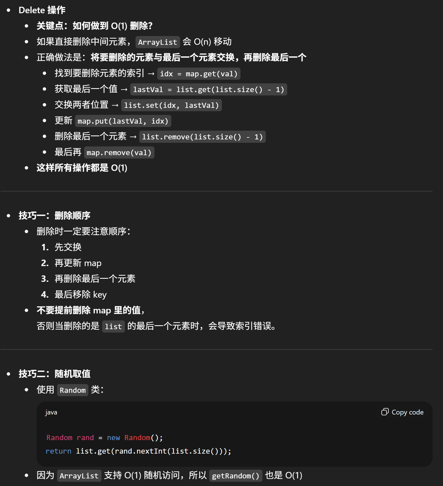

# 380. Insert Delete GetRandom O(1)

## Approach hashMap + ArrayList

- time: O(1)
- Space: O(N)





```java
class RandomizedSet {
    private Map<Integer, Integer> map;
    private List<Integer> list;
    private Random rand;

    public RandomizedSet() {
        map = new HashMap<>();
        list = new ArrayList<>();
        rand = new Random();
        
    }
    
    public boolean insert(int val) {
        if (map.containsKey(val)) return false;

        list.add(val);
        map.put(val, list.size()-1);
        return true;
    }
    
    public boolean remove(int val) {
        if (!map.containsKey(val)) return false;

        int idx = map.get(val);
        int lastIdx = list.size()-1;
        int lastVal = list.get(lastIdx);

        Collections.swap(list, idx, lastIdx);
        list.remove(lastIdx);

        map.put(lastVal, idx);
        map.remove(val); // this has to be the last step, or went wrong when you trying to remove the last element in the list  
        return true;
    }
    
    public int getRandom() {
        return list.get(rand.nextInt(list.size()));
    }
}

/**
 * Your RandomizedSet object will be instantiated and called as such:
 * RandomizedSet obj = new RandomizedSet();
 * boolean param_1 = obj.insert(val);
 * boolean param_2 = obj.remove(val);
 * int param_3 = obj.getRandom();
 */

```